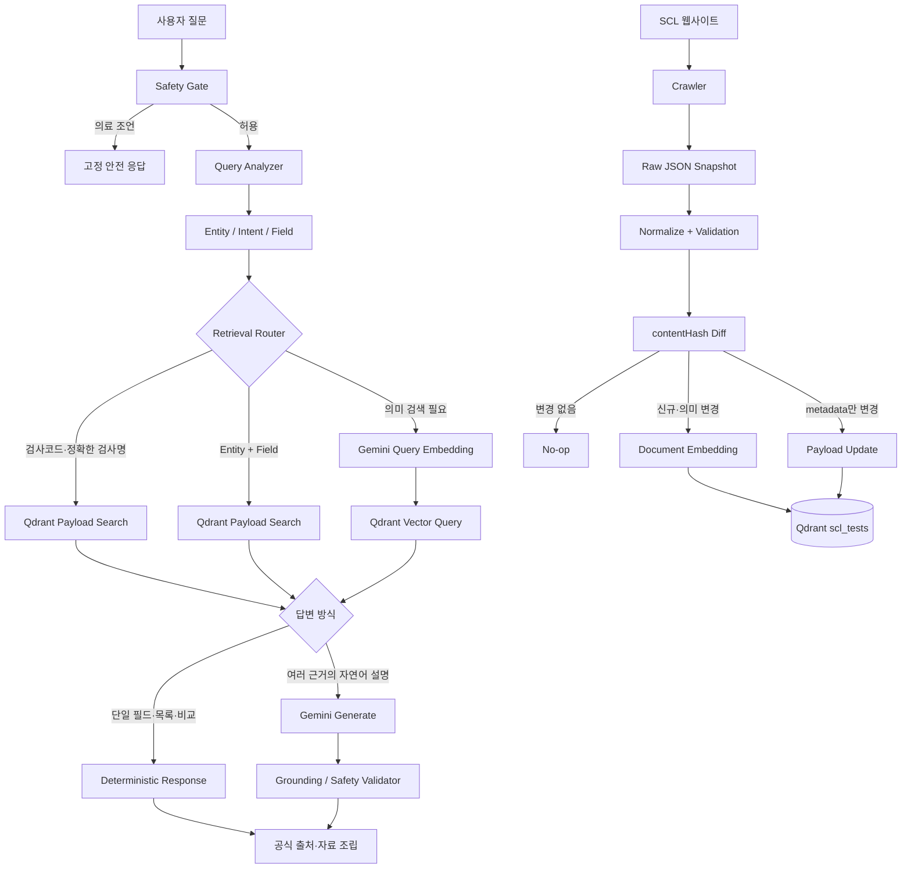

# SCL 검사정보 챗봇

SCL 공개 검사정보를 대상으로 하는 intent-aware 검색 챗봇입니다.

> DB에 있는 사실은 DB가 답하고, 비교 가능한 사실은 프로그램이 계산하며, 검색하기 어려운 자연어는 Vector Search가 찾고, 자연스러운 설명이 필요한 경우에만 LLM을 사용합니다.

SCL 데이터를 주기적으로 확인하고 `contentHash`가 변경된 데이터만 갱신·재임베딩합니다. Qdrant를 런타임 저장소로 사용하므로 동기화 후 Node 서버를 재시작할 필요가 없습니다.

## Architecture



### 컴포넌트

- React/Vite: 질문, loading, 오류/retry, 답변, 관련 검사, 공식 출처, PDF/이미지, 의료정보 제한 안내
- Node API: Safety Gate, Query Analyzer, Retrieval Router, 결정적 응답, 생성·출력 검증, 통계, health check
- Qdrant: exact payload 검색과 768차원 cosine vector 검색을 분리해 제공
- Gemini Embedding: exact/structured로 풀 수 없는 의미 검색과 신규·의미 변경 문서에만 사용
- Gemini Generate: 여러 공식 근거를 자연스럽게 설명해야 하는 `EXPLANATION`에서만 사용

## 질문 분석

`Query Analyzer`는 AI 호출 없이 다음을 분석합니다.

- Entity: 검사코드, 복수 검사코드, 정규화된 검사명 후보
- Intent: `FIELD_LOOKUP`, `COMPARISON`, `SEARCH`, `EXPLANATION`, `RESOURCE_REQUEST`, `MEDICAL_ADVICE`, `UNKNOWN`
- Field: `testCode`, `testName`, `specimen`, `method`, `insuranceCode`, `schedule`, `timeType`, `turnaroundTime`, `sourceUrl`, `pdfUrls`, `imageUrls`

명확한 표현만 alias로 연결합니다. 예를 들어 `며칠 걸려`, `결과 언제`, `소요일`은 `turnaroundTime`이고 `검체 종류`는 `specimen`입니다.

## Retrieval과 답변

### Exact

검사코드 또는 정확한 검사명은 Qdrant payload index로 조회합니다. Query embedding, vector query, Generate 호출이 없습니다. 동일 `testCode`라도 `sampleCode`나 검체가 다르면 별도 point로 유지합니다.

### Structured

Entity와 Field가 확인되면 payload 값을 직접 답합니다.

```text
16290 검사 며칠 걸려?
→ α-Galactosidase (GLA)_Fabry 검사의 소요일은 5일입니다.
```

Embedding 0회, Generate 0회입니다.

### Comparison

두 검사의 소요일을 직접 조회하고 보수적으로 파싱한 일수 범위를 프로그램이 비교합니다. 범위가 겹치거나 비교 대상이 없으면 빠르다/느리다를 추측하지 않습니다.

### Semantic

코드, 정확한 이름, 구조화 필드로 해결되지 않을 때만 질문을 `gemini-embedding-001`의 768차원 query vector로 변환합니다. Qdrant가 cosine score threshold와 top-K를 적용합니다. 검색 목록은 결정적으로 조립하므로 Generate를 다시 호출하지 않습니다.

### Explanation

여러 필드를 자연스럽게 정리할 필요가 있을 때만 Generate를 호출합니다. 모델에는 검색된 SCL evidence와 허용된 source ID만 전달합니다.

## Qdrant

- Collection: `scl_tests`
- Vector: 768차원, Cosine
- Payload: `id`, `testCode`, `sampleCode`, `testName`, `normalizedTestName`, `specimen`, `method`, `insuranceCode`, `schedule`, `timeType`, `turnaroundTime`, `content`, `keywords`, `sourceUrl`, `pdfUrls`, `imageUrls`, `crawledAt`, `updatedAt`, `contentHash`, `payloadHash`, `active`
- Payload index: `id`, `testCode`, `sampleCode`, `normalizedTestName`, `contentHash`, `active`
- Storage: Docker named volume `scl_qdrant_storage`

기존 `server/rag/index/vector-index.json`은 런타임에서 사용하지 않습니다. 초기 migration에서 동일 문서 ID의 레거시 vector를 재사용할 수 있도록만 보존합니다.

## 의료 안전성

세 단계에서 방어합니다.

1. 입력: 개인 결과 해석, 질병 진단, 약·복용법, 치료 결정, 개인 맞춤 검사 추천을 retrieval 전에 고정 응답으로 차단합니다.
2. 생성: SCL evidence 밖 사실, 진단, 치료·약물 추천, 존재하지 않는 검사와 URL을 금지합니다.
3. 출력: source ID, 공식 SCL HTTPS URL, 원문 evidence, evidence에 없는 수치, 진단·치료·약물 표현을 검증합니다. 위반한 생성 답변은 반환하지 않습니다.

입력 차단 질문은 Embedding, Qdrant vector query, Generate 모두 0회입니다. 이 서비스는 의료적 진단용이 아닙니다.

## 데이터 수집과 Near Real-Time Synchronization

Raw JSON은 수집 기록, 디버깅, 회귀 테스트, 비교와 감사용입니다. 런타임 조회에는 사용하지 않습니다.

```text
SCL → 목록/상세 crawler → Raw snapshot → Knowledge JSON → validation → Qdrant sync
```

`npm run scl:sync`는 전체 목록을 예의 있는 rate limit으로 확인하고, 설정한 상세 refresh 주기보다 오래된 상세만 다시 수집한 뒤 Qdrant를 증분 갱신합니다. 공식 API/webhook이 없으므로 실시간이 아니라 Near Real-Time Synchronization입니다.

증분 규칙은 다음과 같습니다.

- 신규: embedding 후 upsert
- `contentHash` 변경: 해당 point만 재embedding 후 upsert
- URL/자료 등 payload metadata만 변경: vector 없이 payload update
- 변경 없음: embedding과 update 없음
- 사라진 항목: 즉시 삭제하지 않고 `active=false`
- 실패 기록이 있거나 신규 스냅샷이 기존 active 데이터의 80% 미만이면 비활성화 생략

동기화는 `scanned`, `created`, `updated`, `unchanged`, `deactivated`, `embeddingCalls`, `embeddedDocuments`, `failures`를 로그합니다. Qdrant를 요청마다 조회하므로 갱신 후 Node 재시작이 필요하지 않습니다.

Node 내부 scheduler는 `SCL_SYNC_ENABLED=true`일 때 `SCL_SYNC_INTERVAL`(밀리초)마다 실행됩니다. 운영에서는 플랫폼 Scheduled Job/Cron으로 `npm run scl:sync`를 실행하는 편을 권장합니다. 최소 1시간 이상으로 설정하고 SCL 사이트에 과도한 부하를 주지 마세요.

## AI 호출량과 성능

`GET /api/stats`는 사용자 원문을 저장하지 않고 다음 카운터와 경로별 평균 latency를 메모리에 집계합니다.

`totalQueries`, `exactQueries`, `structuredQueries`, `comparisonQueries`, `vectorQueries`, `embeddingCalls`, `generationCalls`, `blockedMedicalQueries`, `noResultQueries`, `embeddingBypassRate`, `generationBypassRate`

서버 실행 중 `npm run benchmark:queries`로 Exact, Structured, Comparison, Vector를 각각 측정할 수 있습니다. 기본 3회이며 Vector 시나리오는 실행마다 실제 query embedding 비용이 발생합니다. 반복 수는 `CHATBOT_BENCHMARK_ITERATIONS`로 조절합니다.

## 로컬 실행

요구사항: Node.js 20.19 이상, Docker/Compose, Gemini API key.

```bash
docker compose up -d
npm install
npm run qdrant:health
npm run qdrant:seed
npm run chatbot:server
npm run dev
```

첫 시드에서는 Knowledge JSON과 ID가 같은 레거시 vector를 우선 재사용합니다. 레거시 vector가 없거나 신규 문서이면 Gemini API key가 필요합니다.

별도 터미널에서 다음을 사용할 수 있습니다.

```bash
npm run scl:sync
npm run scl:sync:data
npm run benchmark:queries
npm test
npm run test:e2e
npm run build
```

`scl:sync:data`는 live crawl 없이 현재 Knowledge JSON과 Qdrant만 비교합니다.

## API

- `POST /api/chatbot/interpret` body: `{ "question": "16290 며칠 걸려?" }`
- `GET /api/health`: Node, Qdrant 연결, collection, point count, vector dimension, Embedding/Generate 설정 상태. 유료 Gemini 호출 없음
- `GET /api/stats`: AI 우회율과 검색 경로별 latency

개발 UI에서만 응답의 `EXACT`, `STRUCTURED`, `COMPARISON`, `VECTOR`, `BLOCKED` 경로 badge를 표시합니다. production bundle에는 이 badge가 렌더링되지 않습니다.

## 환경변수

`.env.example`을 `.env`로 복사하고 값을 설정합니다. `.env`와 secret은 Git에 커밋하지 않습니다.

```dotenv
GEMINI_API_KEY=
GEMINI_MODEL=gemini-3.1-flash-lite
GEMINI_EMBEDDING_MODEL=gemini-embedding-001
GEMINI_EMBEDDING_DIMENSION=768
QDRANT_URL=http://localhost:6333
QDRANT_API_KEY=
QDRANT_COLLECTION=scl_tests
RAG_TOP_K=5
RAG_MIN_SCORE=0.60
SCL_SYNC_ENABLED=false
SCL_SYNC_INTERVAL=86400000
SCL_DETAIL_REFRESH_INTERVAL_MS=604800000
```

## 테스트

- Unit: Query Analyzer, Safety Gate, vector/embedding 유틸리티, grounding validator
- Integration: intent-aware Qdrant router, 결정적 응답, 증분 sync, API handler
- API: health, CORS, payload 제한, 오류와 공식 URL 검증
- E2E: Playwright 기반 desktop/mobile UI, loading/error/retry/source/resource
- Production: `npm run build`

필수 회귀 시나리오는 exact/structured/natural structured/comparison/ambiguous comparison/semantic/medical/incremental sync를 포함합니다.

## 운영 배포

운영은 React/Node 배포 환경과 외부 접근 가능한 Qdrant를 분리합니다. 운영 환경에서 `localhost:6333`을 사용하지 마세요.

1. Qdrant Cloud 또는 운영 Qdrant collection을 준비합니다.
2. `QDRANT_URL`, `QDRANT_API_KEY`, `GEMINI_API_KEY`를 플랫폼 Secret으로 등록합니다.
3. build/start 명령을 설정하고 `/api/health`가 `ok`인지 확인합니다.
4. Scheduled Job에 `npm run scl:sync`를 등록합니다.
5. crawler egress, SCL rate limit, Qdrant volume/backup 정책을 확인합니다.

현재 Codex 세션에는 배포 플랫폼용 플러그인이 연결되어 있지 않으므로 실제 production URL 생성, Qdrant Cloud 프로비저닝, Secret 등록과 Cron 배포는 자동 수행되지 않습니다.
