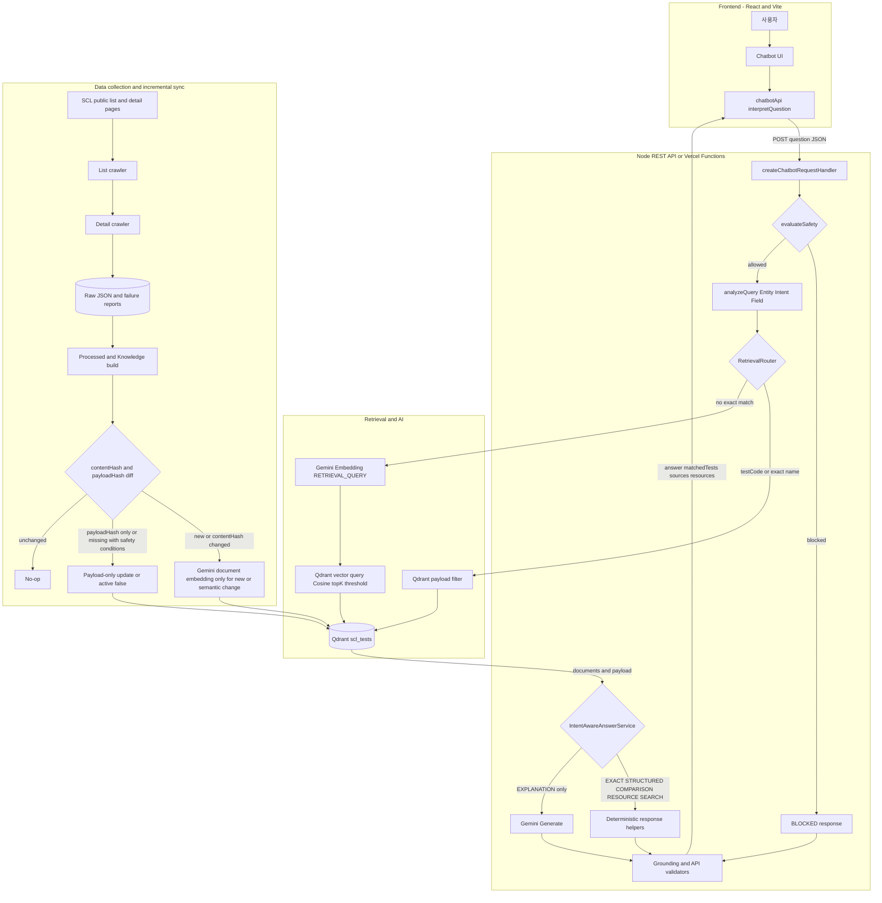

# SCL 검사정보 Hybrid RAG 챗봇 — 최종 보고서 작성용 구현 근거

> 이 문서는 완성형 개발 보고서가 아니라, 보고서 작성에 사용할 수 있는 코드·설정·Git 이력·실행 결과의 사실 자료다. 일반적인 RAG 설명이나 구현 의도 추측은 제외했다.
>
> 조사 기준: `refactor/qdrant-deterministic-rag` 브랜치, 기준 HEAD `f92abaf`, 2026-08-26 최초 조사 후 2026-08-28 검사명 batch exact 개선을 추가 검증. Secret 값과 Vercel 공유 토큰은 기록하지 않았다.

## 1. 프로젝트 개요

### 확인된 목적과 범위

- `package.json`의 설명은 “SCL 공개 검사항목 데이터를 사용하는 RAG 안내 챗봇”이다.
- `src/App.jsx`는 사용자가 검사명 또는 검사코드로 질문하고 SCL 공개 자료에서 관련 정보를 찾는 UI 목적을 명시한다.
- 대상 원문은 SCL 검사 목록과 검사 상세 페이지다. 목록 URL/상세 URL은 `scripts/lib/scl-test-parser.mjs`의 `SCL_TEST_LIST_PATH`, `SCL_TEST_DETAIL_PATH`에 정의되어 있다.
- 현재 질문 범위는 검사코드·검사명 검색, 검체/검사방법/보험코드/검사일/주·야간/소요일 조회, 복수 검사 소요일 비교, 공식 출처·이미지 요청, 의미 기반 관련 검사 검색, 근거 기반 설명이다.
- 단순 문자열 검색 이외에 자연어 field alias 분석, Qdrant payload exact search, Qdrant vector search, 출처/검사 카드/리소스 표시를 제공한다. 근거: `server/rag/queryAnalyzer.js`, `server/rag/retrievalRouter.js`, `src/components/chatbot/*`.
- 의료 진단 시스템이 아니다. 개인 결과 해석, 진단, 치료·수술·약물 결정, 증상 기반 개인 맞춤 검사 추천은 Retrieval 전에 차단한다. 근거: `server/rag/safetyGate.js:evaluateSafety`.
- 공식 데이터에 없는 정보를 추정하지 않는 방향으로 응답을 제한한다. 결정적 응답은 저장 payload로 만들고, 생성 응답은 검색된 문서와 evidence로 사후 검증한다.

### 실제 UI/API

- Frontend: React `19.1.1`, React DOM `19.1.1`, Vite `8.x` (`package.json`; 실제 빌드 출력은 Vite `8.2.1`).
- 주요 UI: `src/App.jsx:App`, `src/components/chatbot/Chatbot.jsx:Chatbot`, `ChatMessage.jsx`, `TestResultPanel.jsx`, `SourceCard.jsx`, `RelatedResource.jsx`.
- API client: `src/services/chatbotApi.js:getChatbotHealth`, `interpretQuestion`, `ChatbotApiError`.
- Backend API: `GET /api/health`, `GET /api/stats`, `POST /api/chatbot/interpret` (`server/chatbotServer.js:createChatbotRequestHandler`).

## 2. 기존 시스템

조사 기준은 Qdrant 개편 직전 commit `506ce2d`이다. 아래 내용은 `git show 506ce2d:<path>`로 확인했다.

### 저장·검색 구조

- Knowledge: `server/rag/knowledge/scl-tests.json` 배열을 `server/rag/retrievalService.js:loadRetrievalService`가 파일에서 읽었다.
- Vector index: `server/rag/index/vector-index.json`에 문서 ID, 문서 메타데이터, 정규화된 embedding vector를 JSON으로 저장했다. 생성기는 `scripts/build-rag-index.mjs`였다.
- Node 시작 시 `server/chatbotServer.js:createRuntimeServices`가 `loadRetrievalService`를 호출해 Knowledge JSON과 vector-index JSON을 메모리에 적재했다.
- lexical search: `RetrievalService.search`가 모든 준비 문서를 순회하며 검사코드 exact에 1000점, 검사명 exact에 700점, 검사명 phrase에 600점+길이, token/keyword 점수를 계산했다.
- strong lexical reason(`test-code-exact`, `test-name-exact`, `test-name-phrase`)이 있으면 query embedding을 생략했다.
- strong lexical match가 없고 vector index와 embedding service가 있으면 Gemini query embedding을 만든 뒤 `vectorStore.js:searchVectorIndex`를 호출했다.
- cosine similarity는 `vectorStore.js:cosineSimilarity`가 JavaScript 반복문으로 dot product와 두 벡터 크기를 계산해 `dot / sqrt(leftSquared * rightSquared)`를 반환했다.
- Top-K 기본값은 5였다. semantic 후보는 `max(topK * 4, 20)`개를 먼저 얻고 lexical 점수와 결합한 후 최종 `topK`만 반환했다.
- similarity threshold는 `RAG_MIN_SIMILARITY`; 당시 `.env.example` 값은 `0.60`이었다. vector index와 embedding을 함께 쓸 때 값이 비어 있으면 서버가 오류를 냈다.
- Embedding 모델/차원 기본값은 `gemini-embedding-001`, 768이었다. `server/rag/embeddingService.js:GeminiEmbeddingService`를 사용했다.
- Generate는 `server/rag/ragAnswerService.js:GeminiGenerationService`를 사용했다.

### 기존 결정적 응답과 생성 범위

- 정확한 단일 검사코드 질문만 `RagAnswerService.answer` → `exactCodeDocument` → `buildExactCodeResponse`로 Gemini Generate를 우회했다.
- 일상 대화, 의료 조언, 검색 결과 없음도 고정 응답으로 처리했다.
- 그 외 검색 결과가 있는 질문은 `generateGroundedAnswer`를 호출했다. 즉 field lookup·비교·일반 semantic 결과에 현재와 같은 별도 결정적 응답 함수가 없었다.

### 데이터 변경과 재시작

- 기존 런타임은 JSON 파일을 서버 시작 시 한 번 읽어 `RetrievalService.documents`, `documentById`, `searchDocuments`, `vectorIndex`에 보관했다.
- 따라서 파일을 다시 생성해도 실행 중 객체는 갱신되지 않았다. 새 Knowledge/vector-index를 사용하려면 Node 프로세스 재시작이 필요했다.
- 현재 저장소에도 `retrievalService.js`, `vectorStore.js`, `build-rag-index.mjs`가 legacy 도구/테스트 용도로 남아 있지만, 현재 `createRuntimeServices`는 이들을 import하지 않는다.

## 3. 개선 목적

아래는 구현 diff로 확인되는 변경 목표다. 홍보성 효과가 아니라 코드상 변경만 적었다.

- 런타임 vector 저장/검색을 로컬 `vector-index.json`+Node cosine 순회에서 Qdrant query로 이동했다.
- 검사코드·정규화 검사명은 Qdrant payload filter로 조회하도록 분리했다.
- 질문을 Entity/Intent/Field로 분석하고 EXACT, STRUCTURED, COMPARISON, VECTOR 경로로 라우팅했다.
- exact/field/comparison/일반 semantic 목록은 코드가 payload 값으로 응답하고, EXPLANATION만 Gemini Generate를 사용하도록 범위를 줄였다.
- 데이터 전체 재임베딩 대신 `contentHash`/`payloadHash` 비교를 통한 증분 sync를 추가했다.
- 의료 입력 차단, 생성 출력 검사, 공식 URL/evidence/sourceId/수치 검증을 별도 모듈로 분리했다.
- query path와 AI 호출 카운터를 추가했다.
- Vercel Node Functions entrypoint와 Preview 배포 설정을 추가했다.
- 근거 commit: `e4caded feat: introduce qdrant deterministic rag`(28 files, +1,693/-39), `42511fd chore: prepare vercel preview deployment`.

## 4. 최종 아키텍처

### Frontend

| 구성 | 실제 파일/함수 | 역할 |
|---|---|---|
| React shell | `src/App.jsx:App` | 챗봇 열기/닫기와 소개 화면 |
| Chatbot state | `src/components/chatbot/Chatbot.jsx:Chatbot` | health 확인, 질문 전송, loading/error/retry, 메시지 상태 |
| API client | `src/services/chatbotApi.js:getChatbotHealth`, `interpretQuestion` | same-origin `/api` 요청과 응답 형식 확인 |
| 결과 UI | `ChatMessage.jsx`, `TestResultPanel.jsx`, `SourceCard.jsx`, `RelatedResource.jsx` | 답변, 검사정보, 공식 출처, 이미지/PDF 렌더링 |
| Dev proxy | `vite.config.js` | `/api`를 `CHATBOT_PROXY_TARGET` 또는 `127.0.0.1:3002`로 전달 |

### Backend

| 구성 | 실제 파일/함수 | 역할 |
|---|---|---|
| Runtime 조립 | `server/chatbotServer.js:createRuntimeServices` | Store, Embedding, Router, Answer Service, Metrics 생성 |
| REST handler | `createChatbotRequestHandler` | CORS, 본문/질문 검증, API routing, 오류 응답 |
| Safety Gate | `server/rag/safetyGate.js:evaluateSafety` | 의료 조언성 입력을 검색 전에 차단 |
| Query Analyzer | `server/rag/queryAnalyzer.js:analyzeQuery` | Entity, Intent, Field 분석 |
| Retrieval Router | `server/rag/retrievalRouter.js:RetrievalRouter.retrieve` | payload exact 또는 vector query 선택 |
| Answer Service | `server/rag/intentAwareAnswerService.js:IntentAwareAnswerService.answer` | 경로별 결정적 응답 또는 제한적 Generate |
| Validator | `server/rag/responseValidator.js`와 `validateChatbotApiResponse` | source/evidence/URL/수치/응답 shape 검사 |
| Vercel adapter | `server/vercelAdapter.js:createVercelHandler` | 함수 인스턴스에서 runtime handler를 lazy singleton으로 재사용 |

### Data/AI/Sync

- Raw: `data/raw/scl-tests-raw.json`, `scl-test-details-raw.json`, failure/report JSON.
- Processed: `data/processed/scl-tests.json`.
- Knowledge: `server/rag/knowledge/scl-tests.json`.
- Runtime DB: Qdrant collection `scl_tests`.
- AI: `GeminiEmbeddingService`와 `GeminiGenerationService`는 Google Generative Language v1beta REST API를 직접 호출한다.
- Sync: crawler → Knowledge build → hash diff → selective embedding/payload update → Qdrant.

### 런타임 호출 순서

1. `Chatbot.handleSend`가 사용자 질문과 loading 메시지를 만든다.
2. `Chatbot.requestAnswer` → `interpretQuestion(question)`이 `{ question }` JSON을 POST한다.
3. `createChatbotRequestHandler`가 Origin, `application/json`, 32 KiB 본문, 비어 있지 않은 1,000자 이하 질문을 검사한다.
4. `IntentAwareAnswerService.answer`가 `evaluateSafety`를 먼저 호출한다. 차단이면 `BLOCKED`로 종료한다.
5. 단순 인사/날씨/점심/농담 패턴이면 SCL 전용 범위 안내를 `NO_RESULT`로 반환한다.
6. `analyzeQuery`가 `{original, normalizedQuestion, entity, intent, field}`를 만든다.
7. `RetrievalRouter.retrieve`가 code → exact name → semantic 순서로 Qdrant를 조회하고 `{path, documents}`를 반환한다.
8. Answer Service가 intent/path에 따라 `exactResponse`, `structuredResponse`, `comparisonResponse`, `resourceResponse`, `semanticResponse` 또는 `generateGroundedAnswer`를 선택한다.
9. 결정적 답변도 `groundedResponse`에서 sourceId/evidence를 만든 뒤 `buildSafeChatbotResponse`로 조립한다. 생성 답변은 `assertSafeGeneratedOutput`과 `validateGeneratedAnswer`를 추가로 통과한다.
10. API 경계의 `validateChatbotApiResponse`가 최종 shape와 공식 URL을 다시 확인한다.
11. React가 `answer`, `matchedTests`, `sources`, `resources`를 표시한다.

## 5. 데이터 수집 파이프라인

### 목록 crawler

- 실행: `npm run crawl:scl` → `scripts/crawl-scl-tests.mjs --all`.
- parser: `scripts/lib/scl-test-parser.mjs:parseTestListPage`.
- 수집 필드: `id`, `type`, `rowNumber`, `testCode`, `sampleCode`, `testName`, `method`, `specimen`, `insuranceCode`, `schedule`, `timeType`, `turnaroundTime`, `sourceUrl`, `listUrl`, `listPage`, `crawledAt`, `captureMode`.
- 안정 ID는 검사코드·검사명·sampleCode·검체·방법을 SHA-256한 앞 12자리로 `makeStableId`가 만든다.
- full crawl은 사이트가 표시한 총건수, 모든 page/row, ID 중복과 source URL 일치를 검사한다.
- 요청 간격 최소 500ms, 기본 1,000ms; timeout 30초; 최대 3회 시도 및 지수형 retry다.

### 상세 crawler

- 실행: `npm run crawl:scl:details`; 구현: `scripts/crawl-scl-test-details.mjs`, `parseTestDetailPage`.
- 추가 필드: 상세 검사명, 보존방법, 소요량, 분류번호, 급여/비급여 코드, 검사수가, 참고치/단위, 채취 주의사항, 임상적 의의, 증가/감소 정보, 급여기준, 검체용기 정보와 이미지, 상세 수집 시각.
- lock file로 중복 실행을 막고 10건마다 checkpoint한다. concurrency 허용 범위는 1~2, 현재 예시는 1이다.
- freshness 기본값은 7일(`SCL_DETAIL_REFRESH_INTERVAL_MS=604800000`)로, 그보다 최근이고 source URL이 같은 상세는 재사용한다.
- PDF 수집은 구현되지 않았다. `buildTestKnowledgeDocument`가 `pdfUrls: []`로 고정한다.
- 이미지 수집은 상세 페이지의 검체용기 이미지에 대해 구현되어 있다.

### 실제 데이터 상태

- 목록 full crawl: 333 pages, 3,327 records, 2026-08-09 수집 report.
- 상세: 성공 3,326, 실패 1, 미시도 0. 실패 항목은 검사코드 `11010`, sample `204`, timeout 3회다.
- 목록 필수 필드 누락 0, 잘못된 source URL 0. `timeType` 빈 값은 38건이다.
- 검체용기/이미지 3,220건, invalid image URL 0.
- Knowledge 3,327건, 평균 content 길이 842자(최소 95, 최대 6,854), invalid document/keyword/resource 0.
- 근거: `data/raw/*-report.json`, `data/processed/scl-tests-build-report.json` 및 2026-08-26 validator 재실행.

### Raw / Processed / Knowledge 구분

| 계층 | 목적·주요 필드 | 생성 | 다음 사용처 |
|---|---|---|---|
| Raw list | SCL 목록 snapshot과 crawl metadata | `crawl-scl-tests.mjs` | 상세 crawler, Knowledge build |
| Raw detail | 목록 필드+상세 필드·containers | `crawl-scl-test-details.mjs` | Processed build |
| Raw failures/reports | 실패 원인/시도 횟수와 coverage | 두 crawler | build fallback, sync 삭제 보호, 검증 |
| Processed | 모든 목록 항목을 상세 성공 또는 `detailStatus=unavailable`로 합친 3,327 records | `build-scl-test-knowledge.mjs` | 감사/검증 및 Knowledge 생성 |
| Knowledge | 검색용 title/content/keywords와 구조화 필드, 공식 URL/resources/metadata | `buildTestKnowledgeDocument` | Qdrant seed/sync |

## 6. Query Analyzer

### Entity

- 검사코드: `(?<!\d)\d{4,8}(?!\d)`로 4~8자리 숫자를 추출하고 중복 제거한다. 영문이 포함된 코드(예: `P1260`)는 이 정규식으로 code entity가 되지 않는다.
- 검사명 후보: legacy 정리 후보에 더해 질문 전체의 영문·숫자·그리스 문자 토큰과 최대 8개 연속 어절을 수집한다. 최대 128개이며 `extractTestNameCandidates`가 생성한다. 영문형 검사명에 붙은 제한된 조사만 후보 사본에서 분리하고 원문은 보존한다.
- 복수 검사: `entity.testCodes.length > 1`이면 `multiple=true`다.
- 출력 entity에는 `testCodes`, 첫 `testName`, 전체 `testNameCandidates`, `multiple`이 포함된다.

### Intent 전체 정의

`INTENTS`에는 `FIELD_LOOKUP`, `COMPARISON`, `SEARCH`, `EXPLANATION`, `RESOURCE_REQUEST`, `MEDICAL_ADVICE`, `UNKNOWN`이 정의되어 있다.

- 분석 우선순위: comparison pattern → resource pattern → field 존재 → explanation pattern → code 존재 → 문자/숫자 존재 → unknown.
- 주의: `MEDICAL_ADVICE` 상수는 정의되어 있지만 `analyzeQuery`가 직접 반환하지 않는다. 의료 분류는 앞 단계 `evaluateSafety`가 수행한다.

### Field와 실제 alias

| Field | alias |
|---|---|
| `testCode` | 검사코드, 코드 |
| `testName` | 검사명, 이름 |
| `specimen` | 어떤 검체, 검체 종류, 검체 |
| `method` | 검사방법, 검사 방법, 검사방식, 검사 방식, 어떻게 검사 |
| `insuranceCode` | 보험코드, 보험 코드, 급여코드, 급여 코드 |
| `schedule` | 검사 요일, 무슨 요일, 검사일, 언제 검사 |
| `timeType` | 주간 검사, 야간 검사, 검사 구분 |
| `turnaroundTime` | 결과 나오는 데, 결과 언제, 언제 나와, 며칠 걸려, 얼마나 걸려, 소요일, 소요 시간, 소요시간 |
| `sourceUrl` | 공식 원문, 원문 링크, 출처, 공식 링크 |
| `pdfUrls` | pdf, 문서 |
| `imageUrls` | 이미지, 사진, 검체용기 |

예: “16290 검사 며칠 걸려?” → code `16290`, intent `FIELD_LOOKUP`, field `turnaroundTime`; “ALT 검사는 어떤 검체를 사용하나요?” → field `specimen`; “공식 링크” → `RESOURCE_REQUEST`가 field lookup보다 먼저 선택된다.

## 7. Retrieval 구조

### 공통 routing

- 경로 상수: `EXACT`, `STRUCTURED`, `COMPARISON`, `VECTOR`, `NO_RESULT`.
- 검사코드가 있으면 `QdrantStore.findByTestCodes`를 가장 먼저 호출한다.
- 검사코드가 없고 검사명 후보가 있으면 `findByExactNames`가 모든 후보를 `normalizedTestName match any` 한 번으로 조회한다. 비비교 질문은 후보 우선순위상 첫 실제 일치 이름만 선택하고, 비교 질문은 일치한 복수 이름을 보존한다.
- exact name 결과가 없으면 `GeminiEmbeddingService.embedQuery` 후 `QdrantStore.semanticSearch`를 호출한다.
- semantic에 필요한 API key가 없으면 `503 SEMANTIC_SEARCH_UNAVAILABLE`; 설명 생성 key가 없으면 `503 GENERATION_UNAVAILABLE`이다.

### Exact Retrieval — “16290 검사 알려줘”

- Analyzer: code `16290`, intent `SEARCH`, field `null`.
- Qdrant filter: `active=true` AND `testCode match any ['16290']`.
- 관련 payload index: `active`, `testCode`.
- `exactPath`는 SEARCH를 `EXACT`로 반환한다.
- `exactResponse`가 payload의 검사코드/검사명으로 답한다.
- Embedding 0, vector search 0, Generate 0. 실제 unit 및 5문항 계측에서 확인했다.
- 2026-08-26 실 Qdrant 응답의 16290은 단일 point이며 `α-Galactosidase (GLA)_Fabry`, sample `510`, `Heparin W/B`, 소요일 `5일`이다.

### Structured Retrieval — “16290 검사 며칠 걸려?”

- Analyzer: entity code `16290`, intent `FIELD_LOOKUP`, field `turnaroundTime`.
- DB 조회는 exact와 같은 payload filter다.
- `structuredResponse` → `fieldValue`가 문서의 `turnaroundTime`을 읽어 문장을 만든다.
- `groundedResponse`가 실제 content의 `검사 소요일:` 줄을 evidence로 선택한다.
- Embedding 0, vector search 0, Generate 0. 실 측정 path `STRUCTURED`, current value `5일`.

### Comparison Retrieval

질문: “16290이랑 11380 중 어떤 검사가 더 빨라?”

- 두 code를 한 번의 `findByTestCodes` any filter로 조회한다.
- 동일 검사코드의 검체 variant를 모두 보존한다. 실 통합 테스트 기준 16290은 1건, 11380은 2건이다.
- `parseTurnaroundDays`는 `당일`/`1일 이내`를 0~1, `N~M일`을 범위, `N일`을 단일 범위로 변환한다.
- `comparisonResponse`가 코드별 최소/최대 범위를 비교한다. 한 범위의 최대가 다른 범위의 최소보다 작을 때만 더 짧다고 단정한다. 동일 범위 또는 겹치는 범위도 별도 문구다.
- Embedding 0, Generate 0. 비교는 JavaScript 코드가 수행한다.
- “16290 검사가 빨리 나오는 편이야?”처럼 비교 대상이 하나면 “현재 확보한 SCL 공식 데이터만으로는 빠른 편인지 판단할 비교 기준이 없습니다”와 공식 소요일을 함께 반환한다. 모집단 평균이나 의료적 속도 기준을 만들지 않는다.

### Semantic Retrieval — “파브리병 관련 검사 알려줘”

1. 숫자 code가 없고 추출된 검사명 후보가 공식 정규화 검사명과 exact match하지 않아 exact 결과가 없다.
2. `RetrievalRouter.retrieve`가 `metrics.embeddingCalls`를 1 증가시키고 `embedQuery`를 호출한다.
3. query task type은 `RETRIEVAL_QUERY`; 모델 기본/배포 설정은 `gemini-embedding-001`.
4. 출력 차원은 768이며 `normalizeVector`로 단위 벡터화한다.
5. `semanticSearch`가 Qdrant `client.query`에 query vector를 전달한다.
6. collection distance는 실제 `Cosine`이다.
7. `RAG_TOP_K`, 기본/현재 예시값 5.
8. `RAG_MIN_SCORE`, 기본/현재 예시값 0.60. legacy `RAG_MIN_SIMILARITY`도 fallback으로 읽는다.
9. Qdrant가 `active=true`, threshold 이상인 point를 score 순으로 최대 5개 반환하고 payload를 포함한다.
10. 일반 SEARCH intent이면 `semanticResponse`가 상위 검사명·코드·검체 목록을 결정적으로 만든다. EXPLANATION intent일 때만 같은 검색 문서를 Gemini Generate에 보낸다.

실제 2026-08-26 질문은 `VECTOR`, grounded=true로 처리되었고 embedding 1회, generation 0회였다.

## 8. Qdrant

### 실제 설정과 상태

| 항목 | 확인값 | 근거 |
|---|---|---|
| Client | `@qdrant/js-client-rest ^1.19.0` | `package.json` |
| Collection | `scl_tests` | `.env.example`, health |
| 상태 | green | 2026-08-26 `getCollection` |
| Point count | 3,327 | `npm run qdrant:health`, Preview health |
| Vector | 768 dimensions | code와 실 collection config |
| Distance | Cosine | `ensureCollection`, 실 collection config |
| on-disk payload | true로 생성 | `QdrantStore.ensureCollection` |
| Payload indexes | `id`, `testCode`, `sampleCode`, `normalizedTestName`, `contentHash`, `active` | code와 실 payload schema(6개) |
| Local REST/gRPC port | 6333 / 6334 | `docker-compose.yml` |
| Docker volume | named volume `scl_qdrant_storage` → `/qdrant/storage` | `docker-compose.yml` |

### 환경변수와 key 처리

- `QDRANT_URL`: default `http://localhost:6333`; 실제 값은 출력하지 않는다.
- `QDRANT_COLLECTION`: default `scl_tests`.
- `QDRANT_API_KEY`: trim 후 빈 문자열이면 client에 `undefined`; 실제 key는 `.env`와 Vercel Sensitive Preview variable에 있고 Git에는 없다.
- `.env`와 `.env.local`은 `.gitignore`; `.env.example`만 tracked다.

### Payload 전체 필드

`toQdrantPayload`가 만드는 필드는 `id`, `testCode`, `sampleCode`, `testName`, `normalizedTestName`, `specimen`, `method`, `insuranceCode`, `schedule`, `timeType`, `turnaroundTime`, `content`, `keywords`, `sourceUrl`, `pdfUrls`, `imageUrls`, `resources`, `metadata`, `crawledAt`, `updatedAt`, `contentHash`, `payloadHash`, `active`다.

### 실제 point 예시(Secret/vector 값 제외)

```json
{
  "id": "194d9432-9eab-5d16-a5e5-9e497c240feb",
  "vector": "[768 finite numbers]",
  "payload": {
    "id": "knowledge-test-16290-510-83ac6c67d9bb",
    "testCode": "16290",
    "sampleCode": "510",
    "testName": "α-Galactosidase (GLA)_Fabry",
    "specimen": "Heparin W/B",
    "method": "LC-MS/MS",
    "schedule": "월,화,수,목",
    "timeType": "주간",
    "turnaroundTime": "5일",
    "active": true
  }
}
```

- vector는 Knowledge content의 의미 검색용 768개 수치다.
- payload는 exact filter, field 응답, 출처/리소스 표시, 변경 감지에 쓰는 구조화 데이터다.

### 기존/현재 저장·검색 비교 근거

| 항목 | 기존 | 현재 |
|---|---|---|
| 저장 | Knowledge JSON + vector-index JSON 파일 | Knowledge snapshot + Qdrant point(vector+payload) |
| 정확 검색 | Node가 메모리의 모든 문서를 lexical scoring | Qdrant indexed payload filter |
| 유사도 | Node `cosineSimilarity` 전체 vector map/sort | Qdrant `client.query` |
| Top-K | Node가 sort/slice | Qdrant query `limit` |
| threshold | Node filter | Qdrant `score_threshold` |
| 변경 반영 | 파일 재생성 후 runtime reload/재시작 | Qdrant upsert/setPayload 후 다음 요청에서 조회 |
| server state | JSON과 vector를 프로세스 메모리에 보관 | Qdrant client/설정만 보관, 결과는 요청마다 DB 조회 |

확장 가능성의 정량 평가나 부하 한계는 확인되지 않음. 코드상 검색 실행 위치가 Node에서 Qdrant로 이동한 사실만 확인됨.

## 9. Embedding / Vector Search

### Gemini Embedding 구현

- 클래스: `server/rag/embeddingService.js:GeminiEmbeddingService`.
- endpoint: Google Generative Language API v1beta의 `embedContent`, `batchEmbedContents`.
- query: `RETRIEVAL_QUERY`; documents: `RETRIEVAL_DOCUMENT`와 title.
- 모델 `GEMINI_EMBEDDING_MODEL` 기본 `gemini-embedding-001`; 차원 `GEMINI_EMBEDDING_DIMENSION` 기본 768.
- 응답 vector 길이와 유한값을 검사하고 L2 정규화한다.
- retry 대상: 408, 409, 429, 5xx. 429는 `Retry-After`, API `RetryInfo`, 설정 delay 중 최대값을 사용한다.
- timeout/retry/batch/delay는 환경변수로 제어한다.

### Qdrant query

- `QdrantStore.semanticSearch(vector, {topK, minScore})`가 `active=true`, `limit`, `score_threshold`, `with_payload=true`, `with_vector=false`로 조회한다.
- 반환 문서에 `retrieval.score`, `retrieval.similarity`, `matchReasons:['semantic']`을 추가한다.
- 런타임 응답에 원 vector는 반환하지 않는다.

### legacy vector 재사용

- `qdrant:seed`는 현재 존재할 경우 `server/rag/index/vector-index.json`을 읽는다.
- `legacyVectorMap`으로 document ID별 vector를 만들고 차원이 Qdrant dimension과 같으면 신규 point 최초 적재 때 재Embedding하지 않고 재사용한다.
- 현재 runtime retrieval은 legacy index를 사용하지 않는다.

## 10. Deterministic Response

결정적 응답은 모델이 문장을 작성하지 않고 Qdrant payload와 코드 분기로 만드는 응답을 뜻한다.

| 함수 | 대상 | 핵심 동작 |
|---|---|---|
| `exactResponse` | 단일/복수 exact | 검사코드와 검사명, 복수 결과의 검체/소요일 표시 |
| `structuredResponse` | FIELD_LOOKUP | 요청 field 값을 그대로 조회; 값이 없으면 공식 데이터에 없다고 응답 |
| `comparisonResponse` | COMPARISON | 소요일 범위를 parsing하여 겹침/동일/짧음 판정 |
| `resourceResponse` | RESOURCE_REQUEST | 공식 PDF/이미지 건수와 서버 조립 리소스 반환 |
| `semanticResponse` | 일반 VECTOR search | 관련 검사 최대 5개와 검체를 목록화 |
| 고정 response | BLOCKED/NO_RESULT/일상 대화 | 검색/생성 없이 범위 안내 또는 의료 안전 안내 |

- 각 grounded 결정적 응답도 `sourceIds`와 Knowledge content의 실제 한 줄 evidence를 만든 뒤 `buildSafeChatbotResponse`를 사용한다.
- 검사별 source URL과 리소스는 모델이 생성하지 않고 저장 payload에서 조립한다.
- `resourceResponse`는 PDF를 지원하지만 현재 실제 Knowledge의 PDF URL은 0건이다.

## 11. Gemini Generate

- 현재 `IntentAwareAnswerService.answer`는 `analysis.intent === EXPLANATION`인 경우에만 `generateGroundedAnswer`를 호출한다.
- 검색 결과가 없거나 exact/structured/comparison/resource/일반 semantic search인 경우 Generate를 호출하지 않는다.
- 모델: `GEMINI_MODEL`, 기본/Preview 설정명 `gemini-3.1-flash-lite`.
- system instruction은 제공된 SCL 자료만 사용, 미확인 정보 추측 금지, 진단/검사/약/치료 권고 금지, URL 생성 금지를 명시한다.
- 입력은 질문과 검색 결과의 sourceId/title/code/name/specimen/method/schedule/timeType/turnaround/content JSON이다.
- 출력은 JSON schema의 `answer`, `grounded`, `sourceIds`, `evidence`만 허용하며 최대 output token은 1,024다.
- Generate 응답 자체의 사실 정확성을 신뢰하지 않고 `validateGeneratedAnswer`를 통과시킨다.

## 12. 의료 안전성

### Input Safety

- `evaluateSafety`가 Query Analyzer와 Qdrant보다 먼저 실행된다.
- 실제 pattern 범주: 검사결과/수치/참고치의 해석·정상/비정상·질병 추론, 양성/음성으로 질병 추론, 진단/확진/병명 요청, 약/복용/용량/처방, 치료/수술 방법·추천, 개인/환자 맞춤 검사 추천, 증상 기반 검사 추천.
- 차단 결과는 `grounded=false`, 빈 sources/resources/tests, `retrievalPath=BLOCKED`이며 의료진 상담과 허용 가능한 공식 검사정보 범위를 안내한다.
- unit test는 의료 질문에서 store/embedding/generation 호출이 모두 0임을 검증한다.

### Generation Safety

- `SCL_SYSTEM_INSTRUCTION`: 검색 자료만 사용, prompt injection 무시, 추측 금지, 진단/치료/약/검사 권고 금지, URL 생성 금지.
- response JSON schema의 `sourceIds` enum은 검색된 document ID로 제한된다.
- `assertSafeGeneratedOutput`이 개인 질병 단정, 약물 복용/추천/처방, 치료/수술 권장을 나타내는 출력 pattern을 거부한다.

### Output/Grounding Safety

`validateGeneratedAnswer`와 API validation이 확인하는 항목:

- 허용된 네 field 이외의 Gemini JSON key 거부.
- `grounded=true`이면 sourceId/evidence 필수; false이면 둘 다 비어 있어야 함.
- sourceId가 검색 결과에 실제 존재하는지 확인.
- 모든 sourceId에 evidence가 있고 evidence sourceId도 선택 목록에 있는지 확인.
- evidence quote가 해당 document content에 연속 문자열로 실제 존재하는지 확인.
- 답변 URL이 저장된 공식 SCL URL인지 확인; 최종 sources/resources도 HTTPS `scllab.co.kr` 또는 하위 도메인만 허용.
- 답변에 나온 숫자/단위 token이 검색 문서 content에 존재하는지 확인.
- 최종 API는 grounded 응답에 공식 source가 있는지, 본문에 URL이 없는지, retrievalPath가 허용 값인지 재검사한다.

한계: 규칙과 grounding 검증은 오류 가능성을 줄이는 구현이며 의료정보 오류 0%를 증명하지 않는다. 전체 질문 공간에 대한 안전성 검증 결과는 확인되지 않음.

## 13. Incremental Sync

### 실행 흐름

- `npm run scl:sync`: 목록 full crawl → 상세 full/refresh crawl → Knowledge build → Qdrant sync.
- `npm run scl:sync:data`: 기존 Knowledge/failure JSON으로 sync만 수행.
- 구현: `scripts/scl-sync.mjs`, `server/sync/incrementalSync.js:syncDocuments`.
- DB의 기존 point를 vector 포함 scroll한 뒤 document ID로 비교한다.

### 상태별 처리

| 상태 | 판정 | 처리 |
|---|---|---|
| 신규 | 기존 document ID 없음 | 동일 차원 legacy vector 재사용, 없으면 document embedding 후 upsert |
| 의미 내용 변경 | 기존 `contentHash !== 새 contentHash` | 해당 문서만 재Embedding 후 기존 point ID에 upsert |
| payload만 변경/재활성화 | contentHash 동일, payloadHash 다름 또는 active가 true 아님 | vector 없이 `setPayload` |
| 변경 없음 | 두 hash 동일, active true | `unchanged++`, DB/AI write 없음 |
| snapshot에서 누락 | 기존 active ID가 새 목록에 없음 | 안전 조건을 만족할 때 삭제 대신 `active=false` |

- deactivation 안전 조건: `failures === 0`이고 새 문서 수가 기존 active 수의 80% 이상(`minimumDeactivationCoverage=0.8`). 하나라도 실패가 있거나 coverage가 낮으면 누락 데이터를 유지한다.
- embedding batch는 service `batchSize`, Qdrant upsert는 100 points씩이다.
- report: `scanned`, `created`, `updated`, `unchanged`, `deactivated`, `embeddingCalls`, `embeddedDocuments`, `failures`.

### contentHash / payloadHash

- `calculateContentHash`의 의미 필드: `testName`, `specimen`, `method`, `schedule`, `timeType`, `turnaroundTime`, `content`.
- 이 중 하나가 바뀌면 retrieval 의미 vector와 표시 facts가 달라질 수 있어 reEmbedding queue로 들어간다.
- `calculatePayloadHash` 필드: `id`, `testCode`, `sampleCode`, `insuranceCode`, `keywords`, `sourceUrl`, `pdfUrls`, `imageUrls`, `resources`, `active`.
- contentHash는 같고 이 hash만 달라지면 vector는 유지하고 payload만 갱신한다.
- 두 hash는 normalize/NFKC/공백 정리/객체 key 정렬 후 SHA-256한다.

### 재시작 없는 반영과 5일→3일→5일 기록

- 현재 `findByTestCodes`, `findByExactName(s)`, `semanticSearch`는 질문마다 Qdrant에 요청한다. Vercel handler가 runtime 객체를 재사용해도 point payload는 캐시하지 않으므로 Qdrant update 이후 Node 재시작이 필요 없다.
- `scripts/simulate-incremental-sync.mjs`는 localhost와 `--confirm-local`에서만 검사코드 한 건의 소요일/content를 바꿔 sync하도록 보호되어 있다.
- unit test에 `5일 → 3일` 변경 시 `scanned=2`, `updated=1`, `unchanged=1`, `embeddingCalls=1`, `embeddedDocuments=1` 검증이 남아 있다.
- `3일 → 5일` 복원까지의 실행 로그 파일은 저장소/Git history에서 확인되지 않음.
- 2026-08-26 실 Qdrant 현재 값이 `5일`인 것은 실제 조회로 확인했다. 이를 복원 실행 로그의 대체 증거로 보지는 않는다.

## 14. AI 호출 최적화

### 경로별 호출 표

| 질문 유형 | Embedding | Qdrant Vector Search | Generate | 근거 |
|---|---:|---:|---:|---|
| Exact code/name | 0 | 0 | 0 | payload filter + `exactResponse` |
| Structured | 0 | 0 | 0 | payload filter + `structuredResponse` |
| Comparison | 0 | 0 | 0 | payload filter + `comparisonResponse` |
| Semantic SEARCH | 1 | 1 | 0 | query embedding + `semanticResponse` |
| Explanation | exact name이면 0, 그 외 보통 1 | exact면 0, 그 외 1 | 1 | retrieval 후 intent가 EXPLANATION일 때 generate |
| Medical Advice | 0 | 0 | 0 | Safety Gate에서 선차단 |
| Out-of-scope casual | 0 | 0 | 0 | `CASUAL_PATTERN` 고정 응답 |
| No semantic result | 1 | 1 | 0 | 검색 후 NO_RESULT |

### 실제 metric 이름

- counters: `totalQueries`, `exactQueries`, `structuredQueries`, `comparisonQueries`, `vectorQueries`, `embeddingCalls`, `generationCalls`, `blockedMedicalQueries`, `noResultQueries`.
- 계산값: `embeddingBypassRate`, `generationBypassRate`.
- latency bucket: `EXACT`, `STRUCTURED`, `COMPARISON`, `VECTOR`, `BLOCKED`, `NO_RESULT`; 각 bucket 최근 최대 1,000 samples.
- 구현: `server/rag/queryMetrics.js:QueryMetrics`; 조회: `GET /api/stats`.
- Vercel에서는 함수 인스턴스 메모리 통계이므로 전체 배포의 영속·집계 통계가 아니다.

### 2026-08-26 대표 5문항 실 측정

새 로컬 API process를 Cloud Qdrant/Gemini 설정으로 시작한 뒤 순서대로 실행했다.

| 질문 | path | 외부에서 잰 elapsed |
|---|---|---:|
| 16290 검사 알려줘 | EXACT | 785.4ms |
| 16290 검사 며칠 걸려? | STRUCTURED | 241.5ms |
| 16290이랑 11380 중 뭐가 빨라? | COMPARISON | 232.7ms |
| 파브리병 관련 검사 알려줘 | VECTOR | 1,156.3ms |
| 파브리병 관련 검사를 전체적으로 설명해줘 | VECTOR+EXPLANATION | 5,235.0ms |

동일 process의 `/api/stats`:

- totalQueries 5; exact/structured/comparison/vector = 1/1/1/2.
- embeddingCalls 2; generationCalls 1.
- 어떤 Gemini API도 호출하지 않은 질문은 앞의 exact/structured/comparison 3개다.
- embedding bypass 60%; generation bypass 80%.
- 내부 평균 latency: EXACT 680.104ms, STRUCTURED 238.848ms, COMPARISON 228.622ms, VECTOR 3,192.804ms(2 samples).
- 이 값은 단일 시점·5문항 표본이며 일반 성능 보장값이 아니다.

2026-08-28 검사명 어순 개선 후 Cloud Qdrant 실측에서는 ALT가 앞·중간·뒤에 있는 field 질문 4개, “AST 말고 ALT” 1개, “ALT와 AST 비교” 1개가 모두 batch payload exact 경로로 처리되었다. 6개 질문의 embedding/generation 호출은 모두 0회였고 응답시간은 224.106~252.955ms였다.

## 15. 성능 측정

### benchmark 구현

- `scripts/benchmark-queries.mjs`; 실행 `npm run benchmark:queries`.
- 시나리오: EXACT “16290 검사 알려줘”, STRUCTURED “16290 검사 며칠 걸려?”, COMPARISON “16290이랑 11380 중 뭐가 빨라?”, VECTOR “파브리병 관련 검사 알려줘”.
- 기본 3 iterations씩 총 12 POST requests다.
- `performance.now()` 직전부터 fetch 응답 JSON parsing과 expected path 확인 완료까지를 재므로 로컬 HTTP, Node 처리, Cloud Qdrant 네트워크가 포함된다.
- VECTOR에는 매회 Gemini query embedding과 Qdrant vector query가 포함된다. 네 시나리오 모두 EXPLANATION이 아니므로 Generate는 포함되지 않는다.
- 대상은 `CHATBOT_BENCHMARK_URL` 기본 `http://127.0.0.1:3002`; iterations는 `CHATBOT_BENCHMARK_ITERATIONS` 기본 3이다.

### 2026-08-26 재실행값

| Path | 횟수 | 평균 | 최소 | 최대 |
|---|---:|---:|---:|---:|
| EXACT | 3 | 411.863ms | 240.889ms | 747.948ms |
| STRUCTURED | 3 | 242.748ms | 239.799ms | 245.989ms |
| COMPARISON | 3 | 242.655ms | 240.534ms | 246.839ms |
| VECTOR | 3 | 909.381ms | 840.078ms | 1,031.970ms |

- 해당 12 requests의 embeddingCalls 3, generationCalls 0.
- benchmark가 결과를 파일로 저장하지는 않는다. 위 수치는 이번 조사 실행 stdout을 기록한 것이다.

## 16. 테스트

### 2026-08-26 실제 결과

| 검증 | 결과 |
|---|---|
| `npm test` 기본 | 57 total, 56 pass, 1 Qdrant opt-in skip, 0 fail |
| Qdrant opt-in test | batch exact name을 포함해 1/1 pass |
| `npm run test:e2e` | 8/8 pass, Edge desktop/mobile, 9.5s |
| `npm run build` | 성공, 24 modules, 634ms; JS 203.96kB(64.85kB gzip), CSS 15.10kB(4.21kB gzip) |
| `crawl:validate` | 성공, 3,327 records |
| `crawl:validate:details` | validator 성공; 상세 dataset 자체는 complete=false(3,326+failure 1로 coverage complete) |
| `rag:knowledge:validate` | 성공, 3,327 documents |
| `integration:validate` | 실패 — 아래 현재 불일치 참조 |

### 테스트 파일/유형

| 유형 | 파일 | 주요 검증 |
|---|---|---|
| API/unit | `tests/chatbot-api.test.mjs` | health, request validation, CORS, 503, 공식 URL, key 없는 exact |
| Embedding unit | `tests/embedding-service.test.mjs` | task type, 정규화/차원, 인증/429 retry |
| Query unit | `tests/query-analyzer.test.mjs` | code/entity/intent/field alias, safety |
| Answer/router integration(mock) | `tests/intent-aware-answer-service.test.mjs` | path, AI bypass, comparison, medical pre-block |
| Incremental unit | `tests/incremental-sync.test.mjs` | 한 건 reEmbedding, payload-only, failure deletion guard |
| Qdrant integration | `tests/qdrant-integration.test.mjs` | 실 collection health와 16290/11380 exact lookup; opt-in |
| Generate/validator unit | `tests/rag-answer-service.test.mjs` | schema/prompt/source/evidence/URL, legacy answer behavior |
| Legacy retrieval unit | `tests/retrieval-service.test.mjs`, `vector-store.test.mjs` | lexical/vector index/cosine 회귀 |
| Vercel unit | `tests/vercel-entrypoints.test.mjs` | 세 function export |
| Playwright E2E | `tests/e2e/chatbot.spec.js`, `mobile.spec.js` | UI, loading, cards, source/image/PDF mock, keyboard, error/retry, health, responsive |

### 확인된 테스트 불일치

- `scripts/validate-frontend-integration.mjs`는 개편 전 health field `services.knowledgeDocuments === 3327`을 기대한다.
- 현재 health는 `pointCount`, `vectorDimension`, `qdrantConnected`, `collectionExists`를 반환하므로 `npm run integration:validate`가 “Vite proxy health 응답의 지식 문서 수가 올바르지 않습니다”로 실패했다.
- 기능 장애 증거라기보다 validation script가 현재 API contract를 따라가지 못한 상태지만, 현재 전체 검증이 모두 green이라고 표현하면 안 된다.

## 17. Docker / 실행환경

### docker-compose.yml

- image: `qdrant/qdrant:v1.15.4`.
- container: `scl-qdrant`.
- ports: `6333:6333`, `6334:6334`.
- volume: `scl_qdrant_storage:/qdrant/storage`.
- restart: `unless-stopped`.
- healthcheck 존재: container 안에서 TCP 6333 open 확인, 10초 간격, timeout 5초, retries 10, start period 10초.

### 로컬 실행 순서

```text
npm install
docker compose up -d
npm run qdrant:health
npm run qdrant:seed
npm run chatbot:server
npm run dev
```

- `npm install`의 postinstall은 `.env`가 없을 때만 `.env.example`을 복사한다. 기존 `.env`는 덮어쓰지 않는다.
- `qdrant:seed`는 DB를 변경하고 신규/변경 문서에 embedding이 필요할 수 있으므로 key/target을 확인한 뒤 실행해야 한다.
- UI와 API를 로컬 개발할 때는 Vite 5173, Node API 3002, Qdrant 6333이 각각 필요하다. Cloud Qdrant를 쓰면 local Docker Qdrant는 불필요하다.

### package.json npm scripts 전체

| Script | 역할 |
|---|---|
| `postinstall`, `setup:env` | `.env` 최초 생성 |
| `dev` | Vite dev server |
| `build` | Vite production build |
| `preview` | Vite built app preview |
| `crawl:scl` / `crawl:scl:sample` | 목록 전체 / 1~3 page 수집 |
| `crawl:scl:details` / `crawl:scl:details:batch` / `crawl:scl:details:sample` | 상세 전체 / 20건 batch / sample 수집 |
| `crawl:validate` | 목록 dataset 검증 |
| `crawl:validate:details` / `crawl:validate:details:sample` | 상세 전체/sample 검증 |
| `rag:knowledge` | Processed와 Knowledge JSON 생성 |
| `rag:knowledge:validate` | Knowledge 일관성 검증 |
| `rag:index` / `rag:index:validate` | legacy local vector-index 생성/검증 |
| `rag:search:smoke` / `rag:search:evaluate` | legacy RetrievalService smoke/threshold 평가 |
| `qdrant:health` | Qdrant 연결/collection/point 확인 |
| `qdrant:seed` | Knowledge를 Qdrant에 증분 seed, legacy vector 선택 재사용 |
| `scl:sync` / `scl:sync:data` | crawl 포함 전체 sync / 기존 파일만 sync |
| `scl:sync:simulate` | localhost에 한해 단일 소요일 변경 sync simulation |
| `chatbot:server` | Node REST API 실행 |
| `benchmark:queries` | 4경로 응답시간/AI calls 측정 |
| `integration:validate` | Vite proxy/API 통합 검증(현재 stale field로 실패) |
| `test:e2e` | Vite server와 Playwright 실행 |
| `test` | Node test runner 전체 |
| `test:parser` | HTML fixture로 목록 parser 1 page 실행 |

### 환경변수 이름과 목적

Secret 값은 출력하지 않는다.

| 그룹 | 변수 | 목적 |
|---|---|---|
| Gemini | `GEMINI_API_KEY` | Embedding/Generate 인증; server only |
| Gemini | `GEMINI_EMBEDDING_MODEL`, `GEMINI_EMBEDDING_DIMENSION`, `GEMINI_EMBEDDING_BATCH_SIZE` | embedding 모델/차원/batch |
| Gemini | `GEMINI_EMBEDDING_REQUEST_DELAY_MS`, `GEMINI_EMBEDDING_REQUEST_TIMEOUT_MS`, `GEMINI_EMBEDDING_MAX_RETRIES`, `GEMINI_EMBEDDING_BUILD_QUOTA_RETRY_DELAY_MS` | 호출 간격/timeout/retry/build quota delay |
| Gemini | `GEMINI_MODEL`, `GEMINI_GENERATION_REQUEST_TIMEOUT_MS`, `GEMINI_GENERATION_MAX_RETRIES` | generate 모델/timeout/retry |
| Qdrant | `QDRANT_URL`, `QDRANT_API_KEY`, `QDRANT_COLLECTION` | endpoint/key/collection |
| RAG | `RAG_TOP_K`, `RAG_MIN_SCORE` | current Qdrant limit/threshold |
| RAG legacy | `RAG_MIN_SIMILARITY` | current router fallback 및 legacy RetrievalService threshold |
| Crawl/sync | `SCL_SYNC_ENABLED`, `SCL_SYNC_INTERVAL` | local Node interval scheduler on/off/간격 |
| Crawl/sync | `SCL_DETAIL_REFRESH_INTERVAL_MS`, `SCL_CRAWL_DELAY_MS`, `SCL_DETAIL_CRAWL_DELAY_MS`, `SCL_DETAIL_CRAWL_CONCURRENCY` | refresh/요청 지연/동시성 |
| API | `CHATBOT_HOST`, `CHATBOT_PORT`, `CHATBOT_ALLOWED_ORIGINS`, `CHATBOT_PROXY_TARGET` | Node bind, CORS, Vite proxy |
| Frontend | `VITE_CHATBOT_API_URL` | browser API base; 비우면 same-origin |
| Benchmark/test | `CHATBOT_BENCHMARK_URL`, `CHATBOT_BENCHMARK_ITERATIONS`, `RUN_QDRANT_INTEGRATION` | benchmark target/count, 실 DB test opt-in |
| Playwright/CI | `PLAYWRIGHT_BROWSER_CHANNEL`, `PLAYWRIGHT_REUSE_SERVER`, `CI` | browser/server reuse/retry-worker 정책 |
| Platform | `VERCEL` | postinstall에서 local `.env` 생성 생략 |

## 18. 배포 상태

### 완료/확인됨

- Vercel project: `scl-rag-chatbot`.
- Preview URL: `https://scl-rag-chatbot-1du1267ac-gunsoo0920.vercel.app`.
- deployment ID: `dpl_4TniFbhqrS4dgWBrjuSF6J7HnVbe`; created 2026-08-28 17:20 KST; target `preview`; status `Ready`(2026-08-28 재확인).
- Vite static build와 Node Functions `api/chatbot/interpret`, `api/health`, `api/stats`가 배포되어 있다. function region 표시는 `iad1`, max duration 30초다.
- Preview 환경변수 등록 확인: `GEMINI_API_KEY`, `GEMINI_MODEL`, `GEMINI_EMBEDDING_MODEL`, `GEMINI_EMBEDDING_DIMENSION`, `QDRANT_URL`, `QDRANT_API_KEY`, `QDRANT_COLLECTION`. key 값은 확인/출력하지 않았다.
- 인증된 Preview `/api/health`: `status=ok`, Node API true, Qdrant connected, collection exists, pointCount 3327, dimension 768, embedding/generation configured.
- Qdrant Cloud로 접근 가능한 remote collection이 Preview에 연결되어 있다. 별도의 Production DB인지 여부는 확인되지 않음.
- GitLab remote branch `origin/refactor/qdrant-deterministic-rag`와 HEAD가 동기화되어 있었다.

### 접근 정책

- 로그인/공유 인증 없는 root 요청은 HTTP 302로 Vercel SSO로 이동한다. 즉 URL만 아는 임의 사용자가 바로 공개 접속하는 상태는 아니다.
- Vercel share link를 가진 사용자의 접근 가능 여부는 실제 공유 기능이 설정되어 있으나, 보안상 share token은 이 문서에 기록하지 않았다.

### 미완료/확인되지 않음

- Production deployment/Production URL: 확인되지 않음. 현재 target은 Preview다.
- Production 전용 환경변수: `vercel env ls`에서 확인되지 않음; 7개 모두 Preview scope였다.
- Production 전용 Qdrant cluster/collection: 확인되지 않음.
- 자동 scheduled sync 배포: 없음. Vercel adapter는 `startSyncScheduler`를 호출하지 않고 Cron 설정도 없다.
- `SCL_SYNC_ENABLED`는 Preview 변수 목록에 없었다. local Node에 interval scheduler 코드는 있으나 기본 false다.
- 배포 plugin: 저장소에서 확인되지 않음. 실제 상태 확인/배포는 Vercel CLI `59.5.0`으로 확인했다.
- CI/CD pipeline 정의(`.gitlab-ci.yml` 등): 확인되지 않음.

## 19. 한계

- 상세 수집이 1건 timeout으로 미완료이며 해당 Knowledge는 목록 정보만 사용한다.
- 목록 `timeType`이 38건 비어 있다.
- 실제 PDF 수집 데이터는 0건이다. Playwright의 PDF 카드는 mock 응답 검증이며 운영 PDF 존재 증거가 아니다.
- sync는 공식 API/webhook 기반 실시간이 아니라 crawler 실행 시점 기반이다. Preview에 scheduler가 없어 현재 자동 Near Real-Time도 배포되지 않았다.
- Preview는 Vercel Authentication 보호 상태이며 Production은 없다.
- metrics는 process memory에만 있어 serverless instance/cold start 간 합산·보존되지 않는다.
- benchmark는 경로별 3회, AI 사용량 표본은 5문항뿐이다. 동시 사용자, 장시간, p95/p99, 부하/비용 시험은 확인되지 않음.
- Query Analyzer는 regex/alias와 DB exact 검증 기반이다. 검사명 위치는 제한하지 않지만 후보가 연속 8어절/128개로 제한되고, 숫자 4~8자리 code만 code entity로 추출하므로 영숫자 code의 direct entity 처리는 제한된다.
- 의료 안전은 규칙 기반 pattern과 output validator로 위험을 줄이지만 모든 표현/오류를 완전 차단한다고 검증되지 않았다.
- semantic/explanation은 Gemini key/quota/network에 의존하며 실패 시 503이 가능하다. exact payload 질문은 key 없이도 처리 가능하다.
- `integration:validate`가 현재 health contract와 불일치해 실패한다.
- legacy local vector scripts와 테스트가 현 runtime 코드 옆에 남아 있어 문서에서 current/legacy를 구분해야 한다.
- actual `5일→3일→5일` 양방향 실행 log, 대규모 incremental production run, scheduled sync 운영 기록은 확인되지 않음.

## 20. Before / After

| 구분 | 기존(506ce2d) | 개편 후(현재) |
|---|---|---|
| Vector 저장소 | local `vector-index.json` | Qdrant `scl_tests` point vector |
| 정확 검색 | Node in-memory 전체 문서 lexical scoring | Qdrant payload filter/index |
| 자연어 검색 | Gemini embedding + Node cosine/map/sort | Gemini embedding + Qdrant vector query |
| AI 호출 | strong lexical이면 embedding 생략; exact code 외 검색 답변은 Generate | exact/structured/comparison/일반 semantic은 Generate 생략; semantic/explanation 조건부 호출 |
| 답변 생성 | exact code만 결정적, 나머지 주로 Gemini | intent/path별 결정적 함수, EXPLANATION만 Gemini |
| 데이터 최신화 | JSON/index rebuild | hash diff와 Qdrant upsert/setPayload/deactivate |
| 서버 재시작 | 시작 시 파일을 메모리에 적재해 변경 후 재시작 필요 | 매 요청 DB 조회로 Qdrant update 후 재시작 불필요 |
| 의료 안전성 | RagAnswerService 내부 입력 pattern+생성 prompt/validator | 선행 Safety Gate + 생성 지침 + output grounding/API validator로 모듈 분리 |
| 운영 API | health/interpret | health/stats/interpret, Vercel Functions |

## 21. 핵심 수치

| 수치 | 값 | 출처 |
|---|---:|---|
| 목록/Processed/Knowledge | 각각 3,327 | JSON/report/validators |
| 고유 검사코드 | 2,597 | Knowledge 집계 |
| 복수 variant가 있는 검사코드 | 451 | Knowledge 집계 |
| 한 코드 최대 variants | 24 | Knowledge 집계 |
| 상세 성공/실패 | 3,326 / 1 | detail report/validator |
| 이미지/PDF URL | 3,220 / 0 | build report/Knowledge 집계 |
| Qdrant points | 3,327 | Cloud health/getCollection |
| Vector dimension/distance | 768 / Cosine | code+실 collection config |
| Payload indexes | 6 | code+실 payload schema |
| RAG Top-K/threshold | 5 / 0.60 | `.env.example`, router |
| Node tests | 기본 57 total, 56 pass+실 Qdrant opt-in 1 pass | 2026-08-28 stdout |
| E2E | 8/8 pass | 2026-08-26 stdout |
| 대표 5문항 Embedding/Generate | 2 / 1 | fresh process `/api/stats` |
| 대표 5문항 AI 완전 우회 | 3/5 | path/counter 계산 |
| Embedding/Generate bypass | 60% / 80% | `/api/stats` |
| benchmark 평균 EXACT/STRUCTURED/COMPARISON/VECTOR | 411.863 / 242.748 / 242.655 / 909.381ms | 각 3회 2026-08-26 실행 |
| 단일 의미 변경 unit report | scanned 2, updated 1, unchanged 1, embeddingCalls 1 | `tests/incremental-sync.test.mjs` |

## 22. 핵심 파일

| 파일 | 역할 | 주요 함수/클래스 |
|---|---|---|
| `src/components/chatbot/Chatbot.jsx` | UI 상태/질문 흐름 | `Chatbot`, `requestAnswer`, `handleSend` |
| `src/services/chatbotApi.js` | API client | `getChatbotHealth`, `interpretQuestion` |
| `server/chatbotServer.js` | REST/API/runtime | `createRuntimeServices`, `createChatbotRequestHandler` |
| `server/vercelAdapter.js` | Serverless adapter | `createVercelHandler` |
| `server/rag/queryAnalyzer.js` | Entity/Intent/Field | `analyzeQuery`, `INTENTS`, `FIELD_ALIASES` |
| `server/rag/retrievalRouter.js` | retrieval 경로 선택 | `RetrievalRouter.retrieve` |
| `server/rag/qdrantStore.js` | DB/collection/search/write | `QdrantStore` |
| `server/rag/intentAwareAnswerService.js` | 경로별 답변 | `IntentAwareAnswerService`, response helper들 |
| `server/rag/embeddingService.js` | Gemini embedding | `GeminiEmbeddingService`, `normalizeVector` |
| `server/rag/ragAnswerService.js` | Gemini Generate와 legacy answer service | `GeminiGenerationService`, `buildGroundingPrompt` |
| `server/rag/safetyGate.js` | 의료 입력/출력 규칙 | `evaluateSafety`, `assertSafeGeneratedOutput` |
| `server/rag/responseValidator.js` | grounding/URL/evidence | `validateGeneratedAnswer`, `buildSafeChatbotResponse` |
| `server/rag/queryMetrics.js` | path/AI/latency | `QueryMetrics` |
| `server/rag/contentIdentity.js` | hash/point/payload | `calculateContentHash`, `calculatePayloadHash`, `toQdrantPayload` |
| `server/sync/incrementalSync.js` | 증분 diff/sync | `syncDocuments`, `legacyVectorMap` |
| `scripts/crawl-scl-tests.mjs` | 목록 crawler | `main`, `assertCrawl` |
| `scripts/crawl-scl-test-details.mjs` | 상세 crawler | `main`, `enrichRecord`, checkpoint/lock |
| `scripts/lib/scl-test-parser.mjs` | 목록 HTML parser | `parseTestListPage` |
| `scripts/lib/scl-test-detail-parser.mjs` | 상세 HTML parser | `parseTestDetailPage` |
| `server/rag/knowledgeService.js` | Knowledge normalize | `buildTestKnowledgeDocument` |
| `scripts/qdrant-seed.mjs` | 최초/증분 seed | `syncDocuments` 호출 |
| `scripts/scl-sync.mjs` | crawl→build→sync orchestration | `runScript` 및 top-level flow |
| `scripts/benchmark-queries.mjs` | latency/AI count | 4 scenarios loop |
| `tests/*.test.mjs`, `tests/e2e/*` | unit/integration/E2E | 16절 참조 |
| `server/rag/retrievalService.js`, `vectorStore.js` | legacy JSON/vector 검색 | current runtime에는 미연결 |

## 23. Git History

현재 branch: `refactor/qdrant-deterministic-rag`; remote tracking branch와 HEAD가 동일했다.

| Commit | Message | 확인된 주요 변경 |
|---|---|---|
| `c1d728a` | SCL RAG 챗봇 초기 구현 | 초기 UI/API/crawler/JSON RAG |
| `506ce2d` | 로컬 환경 자동 설정 추가 | Qdrant 개편 직전 기준, `.env` setup |
| `e4caded` | feat: introduce qdrant deterministic rag | Qdrant store/router, analyzer, deterministic answer, safety, sync, metrics, Docker, tests |
| `0c961d0` | docs: align ui and operations guide | UI/운영 문서 정렬 |
| `42511fd` | chore: prepare vercel preview deployment | Vercel config, 세 API entrypoint, adapter, 관련 test |
| `bcb33a7` | docs: record explicit preview deployment | Preview 배포 정보 문서화 |
| `fce3fef` | docs: update deployed rag architecture | README/architecture/BPMN 현 배포 구조 갱신 |
| `f92abaf` | docs: add project report and troubleshooting | PROJECT_REPORT/TROUBLESHOOTING 추가 |

## 24. 보고서 작성 시 주의사항

| 피해야 할 표현 | 코드/상태에 맞는 표현 |
|---|---|
| “실시간 업데이트” | “관리 작업이 crawler를 실행할 때 Qdrant를 증분 갱신한다. 현재 Preview 자동 scheduler는 없다.” |
| “Vector DB에서 AI가 답한다” | “Qdrant는 payload/vector 검색을 하고, 코드가 대부분의 답변을 조립하며 EXPLANATION만 Gemini가 생성한다.” |
| “AI 없이 모든 자연어를 이해한다” | “정의된 regex/alias로 entity/intent/field를 분석하고, exact가 아닌 의미 질의에는 Gemini embedding을 사용한다.” |
| “AI 호출을 완전히 제거했다” | “exact/structured/comparison을 우회하고 semantic은 embedding, explanation은 generation을 사용한다.” |
| “배포 완료” | “Vercel Preview가 Ready다. Production은 확인되지 않았다.” |
| “누구나 URL로 접속 가능” | “Preview는 Vercel Authentication 보호 상태이며 승인 또는 share access가 필요하다.” |
| “운영 DB 구축 완료” | “Preview에서 remote Qdrant collection 3,327 points 연결을 확인했다. Production 전용 DB는 확인되지 않았다.” |
| “의료정보 오류가 발생하지 않는다” | “입력 차단·grounding·출력 검증을 구현했지만 모든 오류 방지를 보장하지 않는다.” |
| “모든 검사 상세정보 수집 완료” | “목록 3,327건은 full crawl, 상세는 3,326건 성공·1건 실패다.” |
| “PDF와 이미지를 제공한다” | “검체용기 이미지 3,220개가 있으며 현재 실제 PDF URL은 0개다.” |
| “전체 테스트 통과” | “Node 기본 56 pass/1 opt-in skip, 실 Qdrant opt-in 1 pass와 E2E 8/8은 통과했지만 별도 `integration:validate`는 stale health field로 실패한다.” |
| “5→3→5 무중단 갱신을 로그로 입증” | “5→3 unit 검증과 현재 5일 실 조회는 있으나 양방향 실행 로그는 확인되지 않았다.” |
| “높은 확장성/성능을 검증” | “검색 실행 위치를 Qdrant로 이동했다. 부하·동시성·p95/p99 검증은 확인되지 않았다.” |

## 25. 현재 아키텍처 Mermaid


