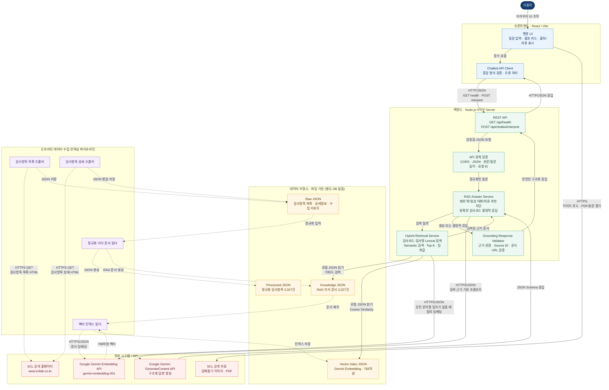

# SCL 검사정보 RAG 챗봇 시스템 아키텍처

```mermaid
flowchart TD
    USER([사용자])

    subgraph FRONTEND["프론트엔드 · React / Vite"]
        direction LR
        UI["챗봇 UI<br/>질문 입력 · 결과 카드 · 출처/자료 표시"]
        CLIENT["Chatbot API Client<br/>응답 형식 검증 · 오류 처리"]
        UI -->|"함수 호출"| CLIENT
    end

    subgraph BACKEND["백엔드 · Node.js HTTP Server"]
        direction TB
        API["REST API<br/>GET /api/health<br/>POST /api/chatbot/interpret"]
        GUARD["API 경계 검증<br/>CORS · JSON · 본문/질문 길이 · 요청 ID"]
        ANSWER["RAG Answer Service<br/>범위 밖/일상 대화/의료 추천 차단<br/>정확한 검사코드 결정적 응답"]
        RETRIEVAL["Hybrid Retrieval Service<br/>검사코드·검사명 Lexical 검색<br/>Semantic 검색 · Top-K · 임계값"]
        VALIDATOR["Grounding Response Validator<br/>근거 문장 · Source ID · 공식 URL 검증"]

        API -->|"검증할 JSON 요청"| GUARD
        GUARD -->|"정규화된 질문"| ANSWER
        ANSWER -->|"검색 질의"| RETRIEVAL
        RETRIEVAL -->|"검색된 근거 문서"| ANSWER
        ANSWER -->|"생성 또는 결정적 응답"| VALIDATOR
        VALIDATOR -->|"안전한 구조화 응답"| API
    end

    subgraph DATA["데이터 저장소 · 파일 기반 (별도 DB 없음)"]
        direction LR
        RAW["Raw JSON<br/>검사항목 목록 · 상세정보 · 수집 리포트"]
        PROCESSED["Processed JSON<br/>정규화 검사항목 3,327건"]
        KNOWLEDGE["Knowledge JSON<br/>RAG 지식 문서 3,327건"]
        VECTOR["Vector Index JSON<br/>Gemini Embedding · 768차원"]
    end

    subgraph PIPELINE["오프라인 데이터 수집·인덱싱 파이프라인"]
        direction LR
        LIST_CRAWLER["검사항목 목록 크롤러"]
        DETAIL_CRAWLER["검사항목 상세 크롤러"]
        KNOWLEDGE_BUILDER["정규화·지식 문서 빌더"]
        INDEX_BUILDER["벡터 인덱스 빌더"]
    end

    subgraph EXTERNAL["외부 시스템 / API"]
        direction LR
        SCL["SCL 공개 홈페이지<br/>www.scllab.co.kr"]
        SCL_FILES["SCL 공개 자료<br/>검체용기 이미지 · PDF"]
        GEMINI_EMBED["Google Gemini Embedding API<br/>gemini-embedding-001"]
        GEMINI_GEN["Google Gemini GenerateContent API<br/>구조화 답변 생성"]
    end

    USER -->|"브라우저 UI 조작"| UI
    CLIENT -->|"HTTP/JSON<br/>GET health · POST interpret"| API
    API -->|"HTTP/JSON 응답"| CLIENT

    RETRIEVAL -->|"로컬 JSON 읽기<br/>키워드 검색"| KNOWLEDGE
    RETRIEVAL -->|"로컬 JSON 읽기<br/>Cosine Similarity"| VECTOR
    RETRIEVAL -->|"HTTPS/JSON<br/>강한 문자열 일치가 없을 때 질의 임베딩"| GEMINI_EMBED
    ANSWER -->|"HTTPS/JSON<br/>검색 근거 기반 프롬프트"| GEMINI_GEN
    GEMINI_GEN -->|"JSON Schema 응답"| ANSWER
    UI -->|"HTTPS<br/>이미지 로드 · PDF/원문 열기"| SCL_FILES

    LIST_CRAWLER -.->|"HTTPS GET<br/>검사항목 목록 HTML"| SCL
    DETAIL_CRAWLER -.->|"HTTPS GET<br/>검사항목 상세 HTML"| SCL
    LIST_CRAWLER -.->|"JSON 저장"| RAW
    DETAIL_CRAWLER -.->|"JSON 병합·저장"| RAW
    RAW -.->|"정규화 입력"| KNOWLEDGE_BUILDER
    KNOWLEDGE_BUILDER -.->|"JSON 생성"| PROCESSED
    KNOWLEDGE_BUILDER -.->|"RAG 문서 생성"| KNOWLEDGE
    KNOWLEDGE -.->|"문서 배치"| INDEX_BUILDER
    INDEX_BUILDER -.->|"HTTPS/JSON<br/>문서 임베딩"| GEMINI_EMBED
    GEMINI_EMBED -.->|"768차원 벡터"| INDEX_BUILDER
    INDEX_BUILDER -.->|"인덱스 저장"| VECTOR

    classDef actor fill:#173F73,color:#fff,stroke:#0B294D,stroke-width:2px;
    classDef frontend fill:#EAF4FF,color:#0B294D,stroke:#3282CE;
    classDef backend fill:#EEF8F3,color:#163A2B,stroke:#2A9D6F;
    classDef data fill:#FFF6E5,color:#513600,stroke:#E4A11B;
    classDef pipeline fill:#F5EEFF,color:#3D205F,stroke:#8A5CC2;
    classDef external fill:#FFF0F0,color:#5B2020,stroke:#D85C5C;

    class USER actor;
    class UI,CLIENT frontend;
    class API,GUARD,ANSWER,RETRIEVAL,VALIDATOR backend;
    class RAW,PROCESSED,KNOWLEDGE,VECTOR data;
    class LIST_CRAWLER,DETAIL_CRAWLER,KNOWLEDGE_BUILDER,INDEX_BUILDER pipeline;
    class SCL,SCL_FILES,GEMINI_EMBED,GEMINI_GEN external;
```

실선은 런타임 질의·응답 흐름, 점선은 크롤링과 지식/벡터 인덱스 생성 흐름을 나타냅니다.
