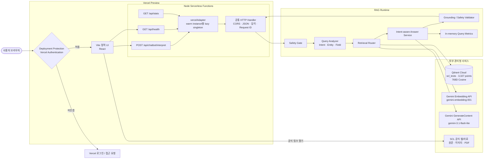
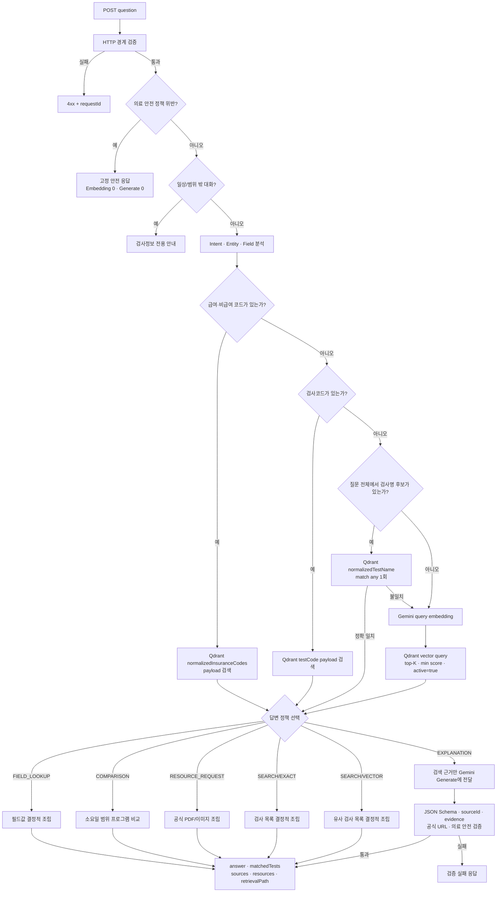
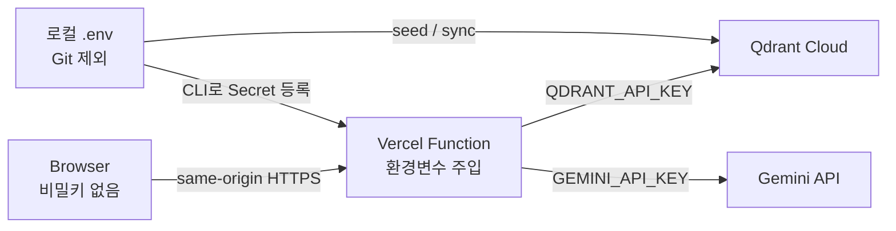
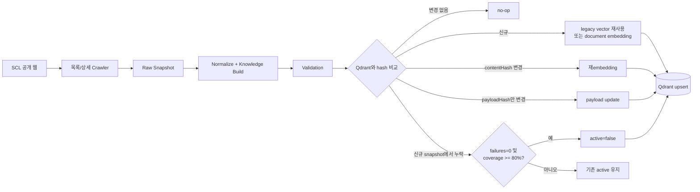

# SCL 검사정보 RAG 챗봇 아키텍처

이 문서는 현재 배포된 React/Vite UI, Vercel Node Functions, Gemini API, Qdrant Cloud 기반 구조를 설명합니다.

> DB에 있는 사실은 DB가 답하고, 비교 가능한 사실은 프로그램이 계산하며, 자연어 검색이 필요할 때만 Embedding을 사용하고, 자연스러운 설명이 필요한 경우에만 생성 모델을 사용합니다.

## 1. 배포 아키텍처

### 현재 Preview 상태

- Preview URL: `https://scl-rag-chatbot-1du1267ac-gunsoo0920.vercel.app`
- 배포 상태: `Preview / Ready`
- Health: `ok`
- Qdrant: `scl_tests`, 3,327 points, 768차원 Cosine
- 접근 정책: Vercel Authentication 활성화
- 외부 사용자의 인증 없는 요청: 앱 대신 Vercel 로그인으로 `302` 리디렉션

따라서 기본 Preview URL은 공개 URL이 아닙니다. 외부 테스트 사용자는 프로젝트 접근 승인을 받거나 Vercel의 Shareable Link를 사용해야 합니다. 완전 공개하려면 Project Settings의 Deployment Protection을 해제해야 합니다.

## 2. 요청 처리 구조

### 검색 방식과 답변 방식

검색 방식과 사용자에게 보여주는 답변 방식은 별개의 결정입니다.

| 구분 | 조건 | 외부 AI 호출 | 결과 |
|---|---|---:|---|
| Payload 검색 | 검사코드, 급여·비급여 코드 또는 정확한 검사명 | 0 | Qdrant의 구조화 payload 조회 |
| Vector 검색 | 코드/정확한 이름으로 찾지 못함 | Embedding 1회 | Qdrant cosine 유사도 검색 |
| 결정적 답변 | 필드, 목록, 자료, 비교, 일반 검색 | Generate 0회 | 저장된 사실을 프로그램이 조립 |
| 생성 답변 | `EXPLANATION` intent | Generate 1회 | 검색 근거 기반 설명 후 검증 |

예를 들어 검사명 후보를 Vector Search로 찾더라도 질문이 검체 필드 조회라면 최종 응답은 `STRUCTURED` 형식으로 조립될 수 있습니다. `/api/stats`의 경로 카운터는 내부 검색 경로를 기준으로 기록됩니다.

## 3. 주요 컴포넌트 책임

### React/Vite UI

- 질문 입력, loading, 오류와 재시도 처리
- 답변, 매칭 검사, 공식 출처, 이미지/PDF 렌더링
- `/api/health`로 연결 상태 확인
- Gemini 및 Qdrant 비밀키를 브라우저에 전달하지 않음

### Vercel API 계층

- `api/health.js`, `api/stats.js`, `api/chatbot/interpret.js`가 Serverless Function 진입점
- `server/vercelAdapter.js`가 세 진입점을 기존 Node HTTP handler에 연결
- warm instance 안에서 런타임 서비스와 클라이언트를 재사용
- 인스턴스가 교체되면 메모리 metrics가 초기화되므로 `/api/stats`는 전역 영속 통계가 아님
- 동일 Vercel 호스트 요청은 forwarded host/protocol 기준으로 CORS 허용
- JSON Content-Type, 32KB 본문 제한, 질문 1,000자 제한, 요청별 UUID 적용

### Safety Gate와 Query Analyzer

- 개인 검사결과 해석, 진단, 치료·약물, 개인 맞춤 검사 추천을 검색 전에 차단
- LLM 호출 없이 검사코드, 급여·비급여 코드, 질문 전체의 검사명 후보 목록, intent, field 분석
- 검사명 위치를 앞부분으로 고정하지 않고 영문·숫자·그리스 문자 토큰과 최대 8어절 후보를 최대 128개 생성
- 후보별 요청 대신 Qdrant `normalizedTestName match any` 한 번으로 실제 검사명만 검증
- 지원 intent: `FIELD_LOOKUP`, `COMPARISON`, `SEARCH`, `EXPLANATION`, `RESOURCE_REQUEST`, `UNKNOWN`

### Qdrant Cloud

- Collection: `scl_tests`
- Vector: 768차원, Cosine
- Exact index: `id`, `testCode`, `sampleCode`, `normalizedTestName`, `normalizedInsuranceCodes`, `contentHash`, `active`
- 런타임 필터: `active=true`
- Payload에는 검사명, 검체, 방법, 보험코드, 검사일, 소요일, 공식 URL, 이미지/PDF, hash가 저장됨

### Gemini

- Embedding: 정확한 payload 검색으로 해결되지 않을 때만 질문 벡터 생성
- Generate: 자연어 설명 intent에서만 검색 근거를 전달해 호출
- `GEMINI_API_KEY`는 Vercel Preview Secret이며 프론트엔드 번들에 포함되지 않음

## 4. 비밀정보와 신뢰 경계

- 소스 저장소와 정적 프론트엔드에는 API 키를 넣지 않습니다.
- 로컬 `.env`와 Vercel Preview 환경변수만 비밀값을 보관합니다.
- `QDRANT_API_KEY`와 `GEMINI_API_KEY`는 Secret으로 등록합니다.
- 키가 화면, 로그, 스크린샷에 노출되면 즉시 폐기하고 재발급합니다.

## 5. 데이터 수집과 증분 동기화

현재 Vercel 배포에는 crawler Cron이 포함되어 있지 않습니다. 데이터 갱신은 신뢰된 로컬/CI 관리 작업에서 `npm run scl:sync` 또는 `npm run scl:sync:data`를 실행해 Qdrant Cloud에 반영합니다. 런타임은 요청마다 Qdrant를 조회하므로 동기화 후 재배포나 서버 재시작이 필요하지 않습니다.

## 6. 운영 상태 확인

- `GET /api/health`: Node API, Qdrant 연결, collection, point count, vector dimension, Gemini 설정
- `GET /api/stats`: instance-local 검색 경로와 AI 호출 우회율
- Vercel Logs: Serverless Function의 4xx/5xx와 request ID 확인
- Qdrant Console: cluster health, point count, 저장공간 확인
- AI Studio: Gemini 요청량과 Free Tier quota 확인

## 7. 로컬 개발과 Preview 차이

| 항목 | 로컬 개발 | Vercel Preview |
|---|---|---|
| UI | Vite dev server | Vercel static output |
| API | `node server/chatbotServer.js` | `api/*` Node Functions |
| Qdrant | Docker 또는 Cloud | Qdrant Cloud 필수 |
| 환경변수 | `.env` | Vercel Preview Environment Variables |
| 접근 통제 | localhost | 현재 Vercel Authentication |
| 동기화 | 로컬 스크립트/스케줄러 | 별도 관리 작업 필요 |
