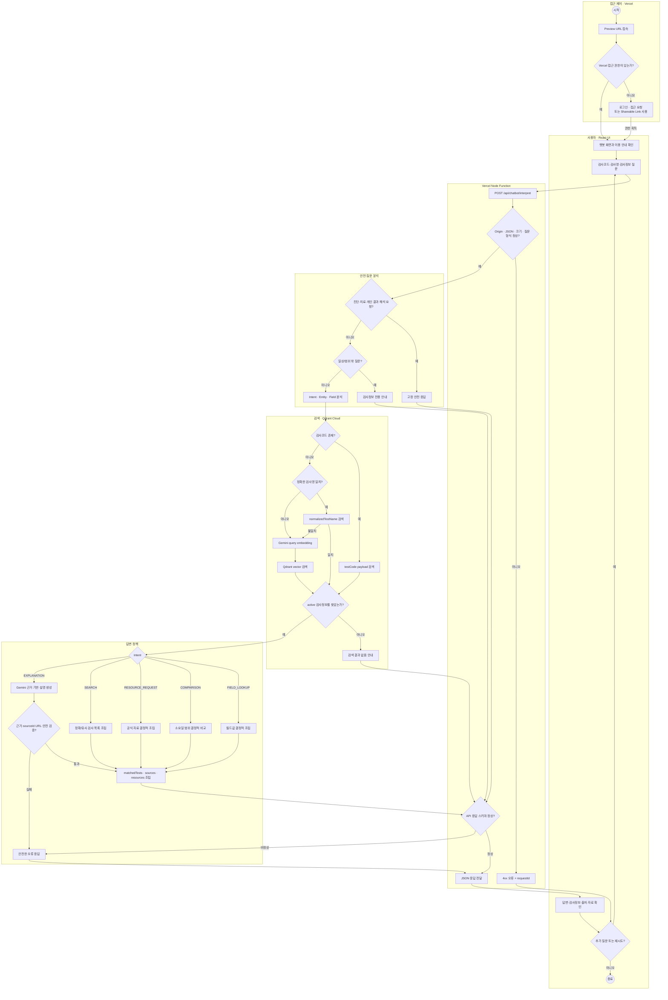
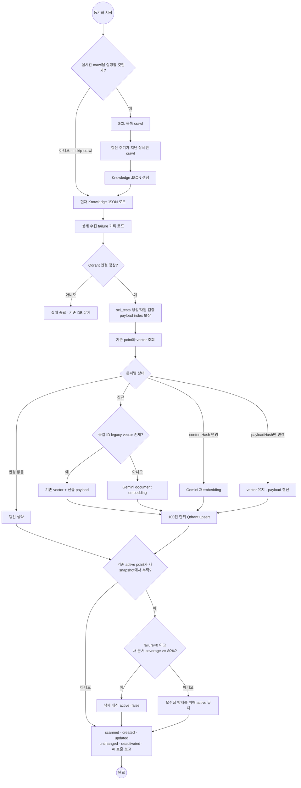

# SCL 검사정보 챗봇 프로세스

## 1. 사용자 질문 처리

```mermaid
flowchart TD
    subgraph ACCESS_LANE["접근 제어 · Vercel"]
        START((시작))
        OPEN["Preview URL 접속"]
        AUTH{"Vercel 접근 권한이 있는가?"}
        LOGIN["로그인 · 접근 요청<br/>또는 Shareable Link 사용"]
    end

    subgraph UI_LANE["사용자 · React UI"]
        WELCOME["챗봇 화면과 이용 안내 확인"]
        ASK["검사코드·검사명·검사정보 질문"]
        SHOW["답변·검사정보·출처·자료 확인"]
        RETRY{"추가 질문 또는 재시도?"}
        END((종료))
    end

    subgraph API_LANE["Vercel Node Function"]
        RECEIVE["POST /api/chatbot/interpret"]
        REQUEST_VALID{"Origin · JSON · 크기 · 질문 형식 정상?"}
        REQUEST_ERROR["4xx 오류 + requestId"]
        RESPONSE_VALID{"API 응답 스키마 정상?"}
        DELIVER["JSON 응답 전달"]
    end

    subgraph POLICY_LANE["안전·질문 분석"]
        SAFETY{"진단·치료·개인 결과 해석 요청?"}
        BLOCK["고정 안전 응답"]
        CASUAL{"일상/범위 밖 질문?"}
        SCOPE["검사정보 전용 안내"]
        ANALYZE["Intent · Entity · Field 분석"]
    end

    subgraph SEARCH_LANE["검색 · Qdrant Cloud"]
        CODE{"검사코드 존재?"}
        CODE_SEARCH["testCode payload 검색"]
        NAME{"정확한 검사명 일치?"}
        NAME_SEARCH["normalizedTestName 검색"]
        EMBED["Gemini query embedding"]
        VECTOR["Qdrant vector 검색"]
        FOUND{"active 검사정보를 찾았는가?"}
        NO_RESULT["검색 결과 없음 안내"]
    end

    subgraph ANSWER_LANE["답변 정책"]
        INTENT{"Intent"}
        FIELD["필드값 결정적 조립"]
        COMPARE["소요일 범위 결정적 비교"]
        RESOURCE["공식 자료 결정적 조립"]
        LIST["정확/유사 검사 목록 조립"]
        EXPLAIN["Gemini 근거 기반 설명 생성"]
        GROUNDING{"근거·sourceId·URL·안전 검증?"}
        GENERATION_ERROR["안전한 오류 응답"]
        ASSEMBLE["matchedTests · sources · resources 조립"]
    end

    START --> OPEN --> AUTH
    AUTH -->|아니오| LOGIN
    LOGIN -->|권한 획득| WELCOME
    AUTH -->|예| WELCOME
    WELCOME --> ASK --> RECEIVE --> REQUEST_VALID
    REQUEST_VALID -->|아니오| REQUEST_ERROR --> RETRY
    REQUEST_VALID -->|예| SAFETY
    SAFETY -->|예| BLOCK --> RESPONSE_VALID
    SAFETY -->|아니오| CASUAL
    CASUAL -->|예| SCOPE --> RESPONSE_VALID
    CASUAL -->|아니오| ANALYZE --> CODE

    CODE -->|예| CODE_SEARCH --> FOUND
    CODE -->|아니오| NAME
    NAME -->|예| NAME_SEARCH
    NAME_SEARCH -->|일치| FOUND
    NAME_SEARCH -->|불일치| EMBED
    NAME -->|아니오| EMBED
    EMBED --> VECTOR --> FOUND
    FOUND -->|아니오| NO_RESULT --> RESPONSE_VALID
    FOUND -->|예| INTENT

    INTENT -->|FIELD_LOOKUP| FIELD --> ASSEMBLE
    INTENT -->|COMPARISON| COMPARE --> ASSEMBLE
    INTENT -->|RESOURCE_REQUEST| RESOURCE --> ASSEMBLE
    INTENT -->|SEARCH| LIST --> ASSEMBLE
    INTENT -->|EXPLANATION| EXPLAIN --> GROUNDING
    GROUNDING -->|통과| ASSEMBLE
    GROUNDING -->|실패| GENERATION_ERROR --> DELIVER
    ASSEMBLE --> RESPONSE_VALID
    RESPONSE_VALID -->|정상| DELIVER --> SHOW --> RETRY
    RESPONSE_VALID -->|비정상| GENERATION_ERROR
    RETRY -->|예| ASK
    RETRY -->|아니오| END
```

## 2. SCL 데이터 동기화

```mermaid
flowchart TD
    START((동기화 시작)) --> MODE{"실시간 crawl을 실행할 것인가?"}
    MODE -->|예| LIST["SCL 목록 crawl"]
    LIST --> DETAIL["갱신 주기가 지난 상세만 crawl"]
    DETAIL --> BUILD["Knowledge JSON 생성"]
    MODE -->|아니오 · --skip-crawl| LOAD["현재 Knowledge JSON 로드"]
    BUILD --> LOAD
    LOAD --> FAILURES["상세 수집 failure 기록 로드"]
    FAILURES --> CONNECT{"Qdrant 연결 정상?"}
    CONNECT -->|아니오| STOP["실패 종료 · 기존 DB 유지"]
    CONNECT -->|예| COLLECTION["scl_tests 생성/차원 검증<br/>payload index 보장"]
    COLLECTION --> SCROLL["기존 point와 vector 조회"]
    SCROLL --> EACH{"문서별 상태"}

    EACH -->|신규| LEGACY{"동일 ID legacy vector 존재?"}
    LEGACY -->|예| CREATE["기존 vector + 신규 payload"]
    LEGACY -->|아니오| EMBED_NEW["Gemini document embedding"]
    EACH -->|contentHash 변경| EMBED_CHANGED["Gemini 재embedding"]
    EACH -->|payloadHash만 변경| PAYLOAD["vector 유지 · payload 갱신"]
    EACH -->|변경 없음| NOOP["갱신 생략"]

    CREATE --> UPSERT["100건 단위 Qdrant upsert"]
    EMBED_NEW --> UPSERT
    EMBED_CHANGED --> UPSERT
    PAYLOAD --> UPSERT
    NOOP --> MISSING
    UPSERT --> MISSING{"기존 active point가 새 snapshot에서 누락?"}
    MISSING -->|아니오| REPORT
    MISSING -->|예| SAFE{"failure=0 이고<br/>새 문서 coverage >= 80%?"}
    SAFE -->|예| DEACTIVATE["삭제 대신 active=false"]
    SAFE -->|아니오| KEEP["오수집 방지를 위해 active 유지"]
    DEACTIVATE --> REPORT["scanned · created · updated<br/>unchanged · deactivated · AI 호출 보고"]
    KEEP --> REPORT
    REPORT --> END((완료))
```

동기화는 운영 요청 경로와 분리된 관리 작업입니다. Qdrant를 직접 갱신하므로 완료 후 Vercel 재배포는 필요하지 않습니다.
