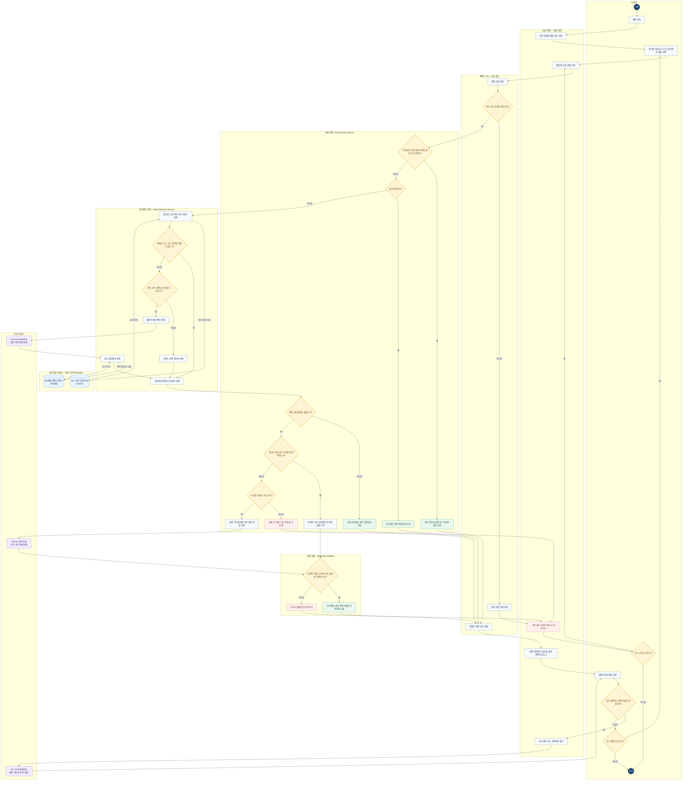

# SCL 검사정보 챗봇 비즈니스 프로세스

```mermaid
flowchart TD
    subgraph USER_LANE["사용자"]
        direction TB
        START((시작))
        OPEN["챗봇 열기"]
        ASK["검사명·검사코드 또는 검사정보 질문 입력"]
        REVIEW["답변과 검사정보 확인"]
        VIEW_SOURCE{"공식 원문이나 관련자료를 열 것인가?"}
        NEXT{"추가 질문이 있는가?"}
        RETRY{"다시 시도할 것인가?"}
        FINISH((종료))
    end

    subgraph FRONT_LANE["프론트엔드 · 챗봇 화면"]
        direction TB
        WELCOME["이용 안내와 질문 예시 제공"]
        SUBMIT["질문 접수 및 답변 요청"]
        SHOW_RESULT["답변·검사정보·검사일·출처·관련자료 표시"]
        SHOW_ERROR["이용 불가 사유와 재시도 안내 표시"]
        OPEN_SOURCE["공식 원문 또는 관련자료 열기"]
    end

    subgraph API_LANE["백엔드 API · 요청 접수"]
        direction TB
        RECEIVE["질문 요청 접수"]
        VALID_REQUEST{"처리 가능한 질문 형식인가?"}
        REJECT_REQUEST["요청 보완 안내 반환"]
        DELIVER["검증된 챗봇 응답 전달"]
    end

    subgraph ANSWER_LANE["답변 정책 · RAG Answer Service"]
        direction TB
        MEDICAL_ADVICE{"증상만으로 검사를 추천해 달라는 요청인가?"}
        SAFE_GUIDE["검사 추천을 제한하고 의료진 상담 안내"]
        CASUAL{"일상 대화인가?"}
        SCOPE_GUIDE["검사정보 전용 챗봇임을 안내"]
        HAS_RESULT{"관련 검사정보를 찾았는가?"}
        NO_RESULT["공개 자료에서 찾지 못했음을 안내"]
        EXACT_CODE{"하나의 검사코드가 정확히 일치하는가?"}
        DIRECT_ANSWER["저장된 공식 검사정보로 직접 답변 구성"]
        AI_AVAILABLE{"AI 답변 생성이 가능한가?"}
        UNAVAILABLE["현재 AI 답변 기능 이용 불가 안내"]
        REQUEST_GENERATION["검색 근거를 바탕으로 답변 생성 요청"]
    end

    subgraph RETRIEVAL_LANE["검사정보 검색 · Hybrid Retrieval Service"]
        direction TB
        KEYWORD_SEARCH["검사코드·검사명·공식 키워드 검색"]
        STRONG_MATCH{"명확한 코드 또는 검사명 일치가 있는가?"}
        SEMANTIC_AVAILABLE{"의미 기반 검색을 사용할 수 있는가?"}
        QUERY_EMBEDDING["질문의 의미 벡터 생성"]
        VECTOR_SEARCH["유사 검사정보 검색"]
        KEYWORD_ONLY["키워드 검색 결과만 사용"]
        MERGE_RESULTS["검색 결과 결합·우선순위 선정"]
    end

    subgraph DATA_LANE["검사정보 저장소 · 파일 기반 Repository"]
        direction TB
        KNOWLEDGE[("SCL 검사 지식 문서<br/>3,327건")]
        VECTOR[("검사정보 벡터 인덱스<br/>768차원")]
    end

    subgraph EXTERNAL_LANE["외부 서비스"]
        direction TB
        GEMINI_EMBED["Gemini Embedding<br/>질의 의미 벡터 반환"]
        GEMINI_GENERATE["Gemini 생성 모델<br/>근거 기반 답변 반환"]
        SCL_SOURCE["SCL 공식 홈페이지<br/>원문·이미지·PDF 제공"]
    end

    subgraph VALIDATION_LANE["답변 검증 · Response Validator"]
        direction TB
        VERIFY{"답변이 검색 근거와 공식 출처에 부합하는가?"}
        BUILD_RESPONSE["검사정보·출처·관련자료를 안전하게 조합"]
        BLOCK_RESPONSE["근거가 불충분한 답변 차단"]
    end

    START --> OPEN
    OPEN --> WELCOME
    WELCOME --> ASK
    ASK --> SUBMIT
    SUBMIT --> RECEIVE
    RECEIVE --> VALID_REQUEST

    VALID_REQUEST -->|"아니오"| REJECT_REQUEST
    REJECT_REQUEST --> SHOW_ERROR
    VALID_REQUEST -->|"예"| MEDICAL_ADVICE

    MEDICAL_ADVICE -->|"예"| SAFE_GUIDE
    MEDICAL_ADVICE -->|"아니오"| CASUAL
    CASUAL -->|"예"| SCOPE_GUIDE
    CASUAL -->|"아니오"| KEYWORD_SEARCH

    KEYWORD_SEARCH -->|"공식 지식 조회"| KNOWLEDGE
    KNOWLEDGE -->|"일치 후보"| KEYWORD_SEARCH
    KEYWORD_SEARCH --> STRONG_MATCH
    STRONG_MATCH -->|"예"| MERGE_RESULTS
    STRONG_MATCH -->|"아니오"| SEMANTIC_AVAILABLE
    SEMANTIC_AVAILABLE -->|"아니오"| KEYWORD_ONLY
    KEYWORD_ONLY --> MERGE_RESULTS
    SEMANTIC_AVAILABLE -->|"예"| QUERY_EMBEDDING
    QUERY_EMBEDDING --> GEMINI_EMBED
    GEMINI_EMBED --> VECTOR_SEARCH
    VECTOR_SEARCH -->|"벡터 유사도 조회"| VECTOR
    VECTOR -->|"유사 후보"| VECTOR_SEARCH
    VECTOR_SEARCH --> MERGE_RESULTS

    MERGE_RESULTS --> HAS_RESULT
    HAS_RESULT -->|"아니오"| NO_RESULT
    HAS_RESULT -->|"예"| EXACT_CODE
    EXACT_CODE -->|"예"| DIRECT_ANSWER
    EXACT_CODE -->|"아니오"| AI_AVAILABLE
    AI_AVAILABLE -->|"아니오"| UNAVAILABLE
    AI_AVAILABLE -->|"예"| REQUEST_GENERATION
    REQUEST_GENERATION --> GEMINI_GENERATE
    GEMINI_GENERATE --> VERIFY

    DIRECT_ANSWER --> VERIFY
    VERIFY -->|"예"| BUILD_RESPONSE
    VERIFY -->|"아니오"| BLOCK_RESPONSE

    SAFE_GUIDE --> DELIVER
    SCOPE_GUIDE --> DELIVER
    NO_RESULT --> DELIVER
    BUILD_RESPONSE --> DELIVER
    DELIVER --> SHOW_RESULT
    SHOW_RESULT --> REVIEW

    REVIEW --> VIEW_SOURCE
    VIEW_SOURCE -->|"예"| OPEN_SOURCE
    OPEN_SOURCE --> SCL_SOURCE
    SCL_SOURCE --> REVIEW
    VIEW_SOURCE -->|"아니오"| NEXT
    NEXT -->|"예"| ASK
    NEXT -->|"아니오"| FINISH

    UNAVAILABLE --> SHOW_ERROR
    BLOCK_RESPONSE --> SHOW_ERROR
    SHOW_ERROR --> RETRY
    RETRY -->|"예"| SUBMIT
    RETRY -->|"아니오"| FINISH

    classDef startEnd fill:#173F73,color:#fff,stroke:#0B294D,stroke-width:3px;
    classDef action fill:#F7FAFC,color:#172B4D,stroke:#5E6C84;
    classDef gateway fill:#FFF4D6,color:#533F03,stroke:#D99A00,stroke-width:2px;
    classDef data fill:#EAF4FF,color:#0B294D,stroke:#3282CE;
    classDef external fill:#F3ECFF,color:#3D205F,stroke:#8A5CC2;
    classDef safe fill:#EAF8F0,color:#174B2D,stroke:#2A9D6F;
    classDef error fill:#FFF0F0,color:#682828,stroke:#D85C5C;

    class START,FINISH startEnd;
    class OPEN,ASK,REVIEW,WELCOME,SUBMIT,SHOW_RESULT,OPEN_SOURCE,RECEIVE,REJECT_REQUEST,DELIVER,SAFE_GUIDE,SCOPE_GUIDE,NO_RESULT,DIRECT_ANSWER,REQUEST_GENERATION,KEYWORD_SEARCH,QUERY_EMBEDDING,VECTOR_SEARCH,KEYWORD_ONLY,MERGE_RESULTS,BUILD_RESPONSE action;
    class VIEW_SOURCE,NEXT,RETRY,VALID_REQUEST,MEDICAL_ADVICE,CASUAL,HAS_RESULT,EXACT_CODE,AI_AVAILABLE,STRONG_MATCH,SEMANTIC_AVAILABLE,VERIFY gateway;
    class KNOWLEDGE,VECTOR data;
    class GEMINI_EMBED,GEMINI_GENERATE,SCL_SOURCE external;
    class SAFE_GUIDE,SCOPE_GUIDE,NO_RESULT,BUILD_RESPONSE safe;
    class SHOW_ERROR,UNAVAILABLE,BLOCK_RESPONSE error;
```

마름모 노드는 업무 판단 지점이며, 각 `subgraph`는 BPMN의 Pool/Lane 역할을 합니다.
